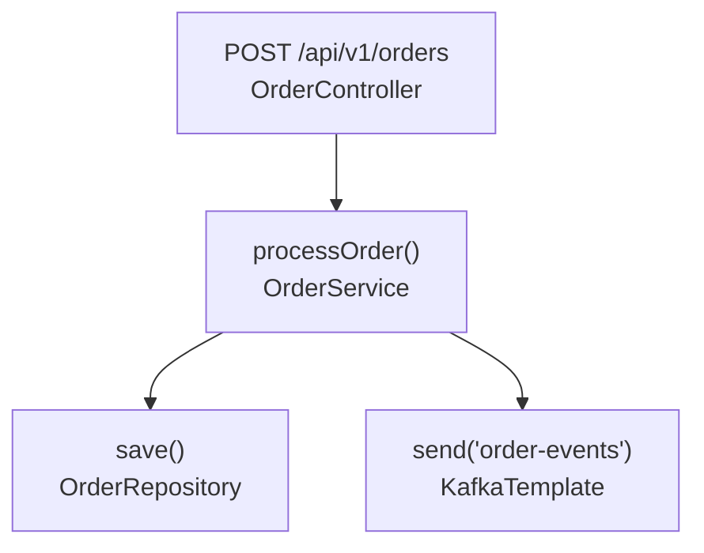

# E004 — Phase 3: Entry-Point-Driven Agentic Functional Requirement Extraction

> **Version:** 2.0.0 (Redefinition)
> **Date:** 2026-06-26
> **Status:** Draft

## 1. Overview

Phase 3 takes the enriched codebase (Phase 1 structural data + Phase 2 semantic enrichment) and employs an **Embabel GOAP agent** to extract holistic functional requirements by **tracing execution flows from entry points**.

### Core Idea

The agent discovers entry points (HTTP endpoints, @Scheduled, @KafkaListener, etc.), traces the execution flow through the call graph (Controller -> Service -> Repository), and for each flow extracts:
- User stories (As a... / I want... / so that...)
- Gherkin acceptance criteria (Given/When/Then)
- Business rules and edge cases
- Traceability to source code

### Key Differences from Previous Design

| Aspect | Previous (Obsolete) | New (This Plan) |
|--------|---------------------|------------------|
| Starting point | Group findings by "boundary" | Discover entry points, trace from there |
| Flow discovery | Static grouping | Dynamic tracing through call graph |
| Depth | Fixed | Adaptive (agent decides per flow) |
| Grouping | Fixed boundaries | Agent decides (semantic clustering) |
| Output format | User stories only | User stories + Gherkin + Mermaid diagrams |
| Output granularity | Same for all flows | Progressive disclosure (simple = minimal, complex = full) |
| Orphaned methods | Not detected | Flagged as dead code or missing entry points |

---

## 2. Architecture

### 2.1 Execution Flow

```
Phase3Orchestrator (pure Java)
  1. Load CodebaseKnowledge from SQLite
  2. Place on Embabel blackboard
  3. Invoke agent
  4. Collect results
  5. Write output files
         |
         v
Embabel GOAP Agent
  discoverEntryPoints --> traceFlow (per entry point)
                              |
                              v
                         analyzeFlow (business rules, user stories, gherkin)
                              |
                              v
                         groupFlows (semantic clustering)
                              |
                              v
                         crossReferenceFlows
                              |
                              v
                         synthesizeSpec
```

### 2.2 GOAP Conditions (World-State)

| Condition ID | String | Set by | Description |
|-------------|--------|--------|-------------|
| `KNOWLEDGE_LOADED` | `codebase_knowledge_loaded` | Phase3Orchestrator | CodebaseKnowledge is on the blackboard |
| `ENTRY_POINTS_DISCOVERED` | `entry_points_discovered` | DiscoverEntryPoints | All entry points identified and scored |
| `FLOW_TRACED` | `flow_traced` | TraceFlow | A specific flow's execution path is traced |
| `FLOW_ANALYZED` | `flow_analyzed` | AnalyzeFlow | A traced flow has business semantics |
| `ALL_FLOWS_TRACED` | `all_flows_traced` | TraceFlow | All prioritized entry points have been traced |
| `FLOWS_GROUPED` | `flows_grouped` | GroupFlows | Flows grouped into features |
| `CROSS_REFS_RESOLVED` | `cross_refs_resolved` | CrossReferenceFlows | Inter-flow dependencies resolved |
| `SPEC_SYNTHESIZED` | `spec_synthesized` | SynthesizeSpec | Final output generated |
| `FLOW_QUARANTINED` | `flow_quarantined` | QuarantineFlow | An unresolvable flow flagged for review |

### 2.3 Agent Actions

#### Action 1: DiscoverEntryPoints
- **Pre:** `KNOWLEDGE_LOADED`
- **Post:** `ENTRY_POINTS_DISCOVERED`
- **Input:** `CodebaseKnowledge` from blackboard
- **Output:** `List<EntryPoint>` on blackboard
- **Logic:**
  1. Query `CodebaseKnowledge` for all findings with types: `ENDPOINT`, `SCHEDULED_TASK`, `KAFKA_LISTENER`, `RABBITMQ_LISTENER`, `ACTIVEMQ_LISTENER`, `EVENT_LISTENER`
  2. Filter trivial endpoints (actuator, health, metrics, swagger, openapi)
  3. Score each entry point by priority (see 2.4)
  4. Sort by priority descending
  5. Detect orphaned methods (see 2.5)

#### Action 2: TraceFlow
- **Pre:** `ENTRY_POINTS_DISCOVERED`
- **Post:** `FLOW_TRACED` (or `ALL_FLOWS_TRACED` when done)
- **Input:** Next unscheduled entry point from blackboard
- **Output:** `ExecutionFlow` on blackboard
- **Logic:**
  1. Pop highest-priority unscheduled entry point
  2. Follow call graph edges from entry point's class/method
  3. Build `FlowStep` list: entry point -> service -> repository -> database
  4. Check sub-chain cache (see 2.6) for shared service chains
  5. Adaptive depth: stop when depth exceeds `max-flow-depth` (default: 5) or no more internal calls
  6. Record unresolved calls (external services, third-party)
  7. If more entry points remain -> set `FLOW_TRACED`, loop back
  8. If all entry points processed -> set `ALL_FLOWS_TRACED`

#### Action 3: AnalyzeFlow
- **Pre:** `FLOW_TRACED`
- **Post:** `FLOW_ANALYZED`
- **Input:** Latest `ExecutionFlow` from blackboard
- **Output:** `FunctionalFlow` with business semantics on blackboard
- **Logic:**
  1. For each `FlowStep`, check `CodebaseKnowledge` for Phase 2 enrichment
  2. If enrichment exists -> use as business purpose, rules, edge cases
  3. If no enrichment -> LLM inference from source code + call context
  4. Extract user story: "As a [role], I want [feature], so that [benefit]"
  5. Extract Gherkin scenarios: Given/When/Then
  6. Extract business rules matrix
  7. Extract edge cases
  8. Apply progressive disclosure (see 2.7)

#### Action 4: GroupFlows
- **Pre:** `FLOW_ANALYZED` or `ALL_FLOWS_TRACED`
- **Post:** `FLOWS_GROUPED`
- **Input:** All `FunctionalFlow` objects on blackboard
- **Output:** `List<FunctionalFeature>` on blackboard
- **Logic:**
  1. Cluster flows by semantic similarity (see 2.8)
  2. Merge related flows into features (e.g., GET/POST /orders = "Order Management")
  3. Assign feature name and description
  4. Link flows within feature

#### Action 5: CrossReferenceFlows
- **Pre:** `FLOWS_GROUPED`
- **Post:** `CROSS_REFS_RESOLVED`
- **Input:** `List<FunctionalFeature>` + `LinkRegistry` from blackboard
- **Output:** `List<FlowRelationship>` on blackboard
- **Logic:**
  1. Check if any flow's unresolved calls target another flow's entry point
  2. Match floating HTTP links to known endpoints
  3. Match topic publications to known consumers
  4. Record relationships (DELEGATES_TO, PUBLISHES_EVENT, CONSUMES_EVENT)

#### Action 6: SynthesizeSpec
- **Pre:** `FLOWS_GROUPED`, `CROSS_REFS_RESOLVED`
- **Post:** `SPEC_SYNTHESIZED`
- **Input:** `List<FunctionalFeature>` + `List<FlowRelationship>` + `List<AmbiguityGap>`
- **Output:** Writes output files (delegated to pure Java writers)
- **Logic:**
  1. Invoke `MarkdownSpecWriter` with features + relationships + gaps
  2. Invoke `SemanticManifestWriter` with features + relationships + gaps
  3. Validate output against schema

#### Action 7: QuarantineFlow
- **Pre:** `FLOW_TRACED`
- **Post:** `FLOW_QUARANTINED`
- **Input:** A flow that exceeded investigation budget or has low confidence
- **Output:** `AmbiguityGap` on blackboard
- **Logic:**
  1. Record reason (STEPS_EXCEEDED, LOW_CONFIDENCE, HOP_DEPTH)
  2. Set confidence score
  3. Add to quarantine list

### 2.4 Flow Priority Scoring

Each entry point receives a priority score (0.0-1.0) that determines tracing order:

```
score = 0.0
score += 0.3 * (has_enrichment ? 1.0 : 0.0)     // Phase 2 already analyzed
score += 0.3 * min(downstream_call_count / 10, 1.0) // Complexity
score += 0.2 * (type == HTTP_ENDPOINT ? 1.0 : 0.5)  // User-facing
score += 0.2 * (has_test_file ? 1.0 : 0.0)          // Testable
```

Rationale:
- Flows with Phase 2 enrichment already have semantic context -> cheaper to analyze
- Complex flows (many downstream calls) are more likely to contain business logic
- User-facing endpoints are more important than internal scheduled tasks
- Flows with test files provide additional context from assertions

### 2.5 Orphaned Method Detection

After tracing all entry points, the agent identifies orphaned methods:
1. Collect all methods called during tracing
2. Collect all methods defined in the codebase (from `CodebaseKnowledge.components`)
3. Find methods that are called but NOT reachable from any entry point
4. Flag as potential dead code or missing entry points

Output: `List<OrphanedMethod>` in the spec's "Unresolved Dependencies" section.

### 2.6 Sub-Chain Caching

When tracing a flow, the agent checks if a shared sub-chain already exists:
1. Before tracing a new entry point, check if its direct callees have been traced
2. If `OrderService.processOrder()` was already traced by `POST /orders`, reuse it for `GET /orders`
3. Cache key: target class + method signature
4. Cache value: `List<FlowStep>` (the traced sub-chain)

This avoids redundant LLM calls and tracing for related endpoints.

### 2.7 Progressive Disclosure

The agent decides output granularity per flow based on complexity:

| Complexity Score | Output Level |
|-----------------|--------------|
| score < 0.3 | **Minimal:** 1-line description, 1 user story, 1 Gherkin scenario |
| 0.3 <= score < 0.7 | **Standard:** User story, 2-3 Gherkin scenarios, business rules matrix |
| score >= 0.7 | **Full:** User story, multiple Gherkin scenarios, business rules, edge cases, traceability table, Mermaid diagram |

Complexity score = `min(flow_steps.length / 10, 1.0) * 0.5 + min(unresolved_count / 5, 1.0) * 0.3 + (has_enrichment ? 0.2 : 0.0)`

### 2.8 Semantic Clustering for Grouping

Flows are clustered using semantic similarity from Phase 2 enrichment:
1. Extract `purpose` field from each flow's Phase 2 enrichment
2. Compute pairwise similarity (Jaccard on keywords, or embedding-based if available)
3. Cluster flows with similarity > threshold (default: 0.6) into features
4. Feature name = most common keyword across clustered flows
5. Feature description = concatenation of flow purposes

Fallback: If no enrichment exists for a flow, cluster by package/directory proximity.

### 2.9 Mermaid Flow Diagrams

For flows with complexity score >= 0.7, the Markdown output includes a Mermaid diagram:

```markdown
### Execution Flow


```

The diagram is generated from the `ExecutionFlow.steps` list. Each node shows the method name and class.

---

## 3. Domain Model

### 3.1 EntryPoint

```java
public record EntryPoint(
    String id,                          // deterministic hash
    EntryPointType type,                // HTTP, SCHEDULED, EVENT_LISTENER, KAFKA, RABBITMQ, ACTIVEMQ
    String httpMethod,                  // GET, POST, etc. (nullable for non-HTTP)
    String path,                        // URL path or topic/queue name
    String className,                   // source class
    String methodName,                  // source method
    String filePath,                    // source file path
    double priorityScore,               // 0.0-1.0
    boolean trivial,                    // filtered out
    List<String> pathVariables,         // extracted from path pattern
    String schedule,                    // cron expression (nullable)
    String topicOrQueue                 // event destination (nullable)
) {}

public enum EntryPointType {
    HTTP, SCHEDULED, EVENT_LISTENER, KAFKA, RABBITMQ, ACTIVEMQ
}
```

### 3.2 ExecutionFlow

```java
public record ExecutionFlow(
    String flowId,                      // deterministic hash
    EntryPoint entryPoint,              // the entry point
    List<FlowStep> steps,               // traced execution path
    int depth,                          // how many layers deep
    List<String> unresolvedCalls,       // external/unresolved method calls
    FlowStatus status                   // TRACED, ANALYZED, QUARANTINED
) {}

public enum FlowStatus {
    TRACED, ANALYZED, QUARANTINED
}
```

### 3.3 FlowStep

```java
public record FlowStep(
    int stepIndex,                      // order in the flow
    FlowStepComponentType componentType, // REST_ENDPOINT, SERVICE, REPOSITORY, DATABASE, EXTERNAL_CALL, EVENT_PUBLISHER
    String className,                   // fully qualified class name
    String methodName,                  // method name
    String businessPurpose,             // from Phase 2 enrichment or LLM inference
    String sourceFile,                  // file path
    int startLine,                      // start line number
    int endLine,                        // end line number
    List<String> enrichments            // Phase 2 enrichment tags
) {}

public enum FlowStepComponentType {
    REST_ENDPOINT, SERVICE, REPOSITORY, DATABASE, EXTERNAL_CALL, EVENT_PUBLISHER, SCHEDULED_TASK
}
```

### 3.4 FunctionalFlow

```java
public record FunctionalFlow(
    String flowId,                      // deterministic hash
    String name,                        // human-readable name
    EntryPoint entryPoint,              // the entry point
    List<FlowStep> steps,               // the traced steps
    String userStory,                   // "As a [role], I want [feature], so that [benefit]"
    List<GherkinScenario> acceptanceCriteria, // BDD scenarios
    List<BusinessRule> businessRules,   // extracted business rules
    List<EdgeCase> edgeCases,           // edge cases and invariants
    ComplexityLevel complexity,         // MINIMAL, STANDARD, FULL
    String mermaidDiagram               // Mermaid flow diagram (nullable for simple flows)
) {}

public enum ComplexityLevel {
    MINIMAL, STANDARD, FULL
}
```

### 3.5 GherkinScenario

```java
public record GherkinScenario(
    String scenarioId,                  // e.g., "SC-01"
    String name,                        // human-readable scenario name
    List<String> givenSteps,            // precondition steps (first → "Given ", rest → "And "/"But ")
    List<String> whenSteps,             // trigger action steps (first → "When ", rest → "And "/"But ")
    List<String> thenSteps,             // expected outcome steps (first → "Then ", rest → "And "/"But ")
    String sourceFlow                   // which flow this comes from
) {}
```

### 3.6 BusinessRule

```java
public record BusinessRule(
    String ruleId,                      // e.g., "BR-01"
    String description,                 // human-readable rule
    String precondition,                // when this rule applies
    String postcondition,               // expected state after rule
    String errorBehavior,               // what happens on violation
    String sourceFile,                  // file path
    int startLine,                      // start line number
    int endLine                         // end line number
) {}
```

### 3.7 EdgeCase

```java
public record EdgeCase(
    String scenario,                    // what happens
    String businessConsequence,         // impact on business
    String sourceFile,                  // file path
    int startLine,                      // start line number
    int endLine                         // end line number
) {}
```

### 3.8 FunctionalFeature

```java
public record FunctionalFeature(
    String featureId,                   // deterministic hash
    String name,                        // human-readable feature name
    String description,                 // what the feature does
    List<FunctionalFlow> flows,         // flows that make up this feature
    List<FlowRelationship> relationships // inter-flow dependencies
) {}
```

### 3.9 FlowRelationship

```java
public record FlowRelationship(
    String sourceFlowId,                // source flow
    String targetFlowId,                // target flow
    FlowRelationshipType type,          // DELEGATES_TO, PUBLISHES_EVENT, CONSUMES_EVENT, CALLS_EXTERNAL
    String description                  // human-readable description
) {}

public enum FlowRelationshipType {
    DELEGATES_TO, PUBLISHES_EVENT, CONSUMES_EVENT, CALLS_EXTERNAL
}
```

### 3.10 AmbiguityGap

```java
public record AmbiguityGap(
    String flowId,                      // which flow has the gap
    String missingContext,              // what's missing
    String suggestedApproach,           // how to resolve
    double confidence,                  // 0.0-1.0
    GapReason reason                    // STEPS_EXCEEDED, LOW_CONFIDENCE, HOP_DEPTH
) {}

public enum GapReason {
    STEPS_EXCEEDED, LOW_CONFIDENCE, HOP_DEPTH
}
```

### 3.11 OrphanedMethod

```java
public record OrphanedMethod(
    String className,                   // fully qualified class name
    String methodName,                  // method name
    String filePath,                    // file path
    int startLine,                      // start line number
    int endLine,                        // end line number
    String reason                       // "no_entry_point_reachable" or "dead_code_suspected"
) {}
```

---

## 4. Output Format

### 4.1 Markdown Specification

```markdown
# Functional Specification: [System Name]

> Generated by code2req on [date]
> Entry points analyzed: [count]
> Features extracted: [count]

## Table of Contents
1. [Feature: Order Management](#feature-order-management)
2. [Feature: Payment Processing](#feature-payment-processing)
...

---

## Feature: Order Management

**Description:** Manages the complete lifecycle of customer orders, from creation through fulfillment.

### User Story
As a store manager, I want to create and manage customer orders, so that I can track sales and fulfillments.

### Execution Flow


### Happy Paths

#### Flow: Create Order
- **Trigger:** POST /api/v1/orders
- **Steps:**
  1. `OrderController.createOrder()` -- receives order request
  2. `OrderService.processOrder()` -- validates inventory, calculates total
  3. `OrderRepository.save()` -- persists order to database
  4. `KafkaTemplate.send("order-events", ...)` -- publishes OrderCreated event
- **Outcome:** Order created with status PENDING, event published

### Business Rules
| ID | Rule | Precondition | Postcondition | Error Behavior |
|----|------|-------------|---------------|----------------|
| BR-01 | Order total must be positive | Order items provided | Total calculated | Reject with HTTP 400 |
| BR-02 | Inventory must be sufficient | Items in stock | Stock reserved | Reject with HTTP 409 |

### Edge Cases
| Scenario | Business Consequence |
|----------|---------------------|
| All items out of stock | Order rejected, user notified |
| Payment fails after order created | Order rolled back, inventory released |

### Acceptance Criteria (Gherkin)
```gherkin
Feature: Order Management

  Scenario: Successfully create an order
    Given a customer has items in their cart
    When they submit the order
    Then the order is created with status PENDING
    And an OrderCreated event is published

  Scenario: Reject order with insufficient inventory
    Given a customer has items with insufficient stock
    When they submit the order
    Then the order is rejected with HTTP 409
    And no OrderCreated event is published
```

### Traceability
| Component | File | Lines |
|-----------|------|-------|
| OrderController | src/main/java/.../OrderController.java | 15-45 |
| OrderService | src/main/java/.../OrderService.java | 23-89 |
| OrderRepository | src/main/java/.../OrderRepository.java | interface |

---

## Feature: Payment Processing
...

## Cross-Flow Relationships
| Source Flow | Target Flow | Type | Description |
|-------------|-------------|------|-------------|
| Create Order | Process Payment | DELEGATES_TO | Order creation triggers payment processing |

## 5. Unresolved Dependencies & Review Tasks
- **[Flow: ExternalPaymentGateway]** -- investigation budget exceeded
  - Source: PaymentService.java:142 -> PaymentGatewayClient.java (not in scan targets)
  - Reason: STEPS_EXCEEDED (max-flow-depth = 5)
  - CLI: `review show --task a1b2c3d4...`

## 6. Orphaned Methods
| Class | Method | File | Reason |
|-------|--------|------|--------|
| LegacyReportGenerator | generatePDF() | LegacyReportGenerator.java:45 | No entry point reachable |
```

### 4.2 Semantic Manifest JSON Schema

```json
{
  "$schema": "http://json-schema.org/draft-07/schema#",
  "title": "SemanticManifest",
  "type": "object",
  "required": ["manifest_version", "system_name", "features"],
  "properties": {
    "manifest_version": { "type": "string", "enum": ["3.0.0"] },
    "system_name": { "type": "string" },
    "generated_at": { "type": "string", "format": "date-time" },
    "features": {
      "type": "array",
      "items": {
        "type": "object",
        "required": ["feature_id", "name", "description", "flows"],
        "properties": {
          "feature_id": { "type": "string" },
          "name": { "type": "string" },
          "description": { "type": "string" },
          "flows": {
            "type": "array",
            "items": {
              "type": "object",
              "required": ["flow_id", "entry_point", "steps", "user_story", "acceptance_criteria", "complexity"],
              "properties": {
                "flow_id": { "type": "string" },
                "entry_point": {
                  "type": "object",
                  "required": ["type", "class_name", "method_name", "file_path"],
                  "properties": {
                    "type": { "type": "string", "enum": ["HTTP", "SCHEDULED", "EVENT_LISTENER", "KAFKA", "RABBITMQ", "ACTIVEMQ"] },
                    "http_method": { "type": ["string", "null"] },
                    "path": { "type": ["string", "null"] },
                    "class_name": { "type": "string" },
                    "method_name": { "type": "string" },
                    "file_path": { "type": "string" },
                    "schedule": { "type": ["string", "null"] },
                    "topic_or_queue": { "type": ["string", "null"] }
                  }
                },
                "steps": {
                  "type": "array",
                  "items": {
                    "type": "object",
                    "required": ["step_index", "component_type", "class_name", "method_name", "source_file"],
                    "properties": {
                      "step_index": { "type": "integer" },
                      "component_type": { "type": "string", "enum": ["REST_ENDPOINT", "SERVICE", "REPOSITORY", "DATABASE", "EXTERNAL_CALL", "EVENT_PUBLISHER", "SCHEDULED_TASK"] },
                      "class_name": { "type": "string" },
                      "method_name": { "type": "string" },
                      "business_purpose": { "type": ["string", "null"] },
                      "source_file": { "type": "string" },
                      "start_line": { "type": "integer" },
                      "end_line": { "type": "integer" }
                    }
                  }
                },
                "user_story": { "type": "string" },
                "acceptance_criteria": {
                  "type": "array",
                  "items": {
                    "type": "object",
                    "required": ["scenario_id", "name", "given", "when", "then"],
                    "properties": {
                      "scenario_id": { "type": "string" },
                      "name": { "type": "string" },
                      "given": {
                        "type": "array",
                        "items": { "type": "string" },
                        "description": "Precondition steps — first element is the primary Given, subsequent are And/But continuations"
                      },
                      "when": {
                        "type": "array",
                        "items": { "type": "string" },
                        "description": "Trigger action steps — first element is the primary When, subsequent are And/But continuations"
                      },
                      "then": {
                        "type": "array",
                        "items": { "type": "string" },
                        "description": "Expected outcome steps — first element is the primary Then, subsequent are And/But continuations"
                      }
                    }
                  }
                },
                "business_rules": {
                  "type": "array",
                  "items": {
                    "type": "object",
                    "required": ["rule_id", "description", "error_behavior"],
                    "properties": {
                      "rule_id": { "type": "string" },
                      "description": { "type": "string" },
                      "precondition": { "type": ["string", "null"] },
                      "postcondition": { "type": ["string", "null"] },
                      "error_behavior": { "type": "string" },
                      "source_file": { "type": ["string", "null"] },
                      "start_line": { "type": ["integer", "null"] },
                      "end_line": { "type": ["integer", "null"] }
                    }
                  }
                },
                "edge_cases": {
                  "type": "array",
                  "items": {
                    "type": "object",
                    "required": ["scenario", "business_consequence"],
                    "properties": {
                      "scenario": { "type": "string" },
                      "business_consequence": { "type": "string" },
                      "source_file": { "type": ["string", "null"] }
                    }
                  }
                },
                "complexity": { "type": "string", "enum": ["MINIMAL", "STANDARD", "FULL"] },
                "mermaid_diagram": { "type": ["string", "null"] },
                "review_required": { "type": "boolean" },
                "unresolved_reason": {
                  "oneOf": [
                    { "type": "null" },
                    {
                      "type": "object",
                      "required": ["reason_type", "detail", "confidence"],
                      "properties": {
                        "reason_type": { "type": "string", "enum": ["STEPS_EXCEEDED", "LOW_CONFIDENCE", "HOP_DEPTH"] },
                        "detail": { "type": "string" },
                        "confidence": { "type": "number", "minimum": 0, "maximum": 1 }
                      }
                    }
                  ]
                }
              }
            }
          }
        }
      }
    },
    "cross_flow_relationships": {
      "type": "array",
      "items": {
        "type": "object",
        "required": ["source_flow_id", "target_flow_id", "type", "description"],
        "properties": {
          "source_flow_id": { "type": "string" },
          "target_flow_id": { "type": "string" },
          "type": { "type": "string", "enum": ["DELEGATES_TO", "PUBLISHES_EVENT", "CONSUMES_EVENT", "CALLS_EXTERNAL"] },
          "description": { "type": "string" }
        }
      }
    },
    "orphaned_methods": {
      "type": "array",
      "items": {
        "type": "object",
        "required": ["class_name", "method_name", "file_path", "reason"],
        "properties": {
          "class_name": { "type": "string" },
          "method_name": { "type": "string" },
          "file_path": { "type": "string" },
          "start_line": { "type": ["integer", "null"] },
          "end_line": { "type": ["integer", "null"] },
          "reason": { "type": "string" }
        }
      }
    }
  }
}
```

---

## 5. Feature Breakdown

### F023: Embabel Agent -- Entry-Point-Driven Extraction (US051)

The core GOAP agent that discovers entry points, traces flows, and extracts functional requirements.

**Actions:** DiscoverEntryPoints, TraceFlow, AnalyzeFlow, GroupFlows, CrossReferenceFlows, SynthesizeSpec, QuarantineFlow

**Depends on:** F022 (CodebaseKnowledge)

**Status:** Rewrite (previously had AnalyzeFindings, ResolveAmbiguity, CrossReferenceLinks, SynthesizeFunctionalSpec, QuarantineUnresolvable)

**SDLC Artifacts:** `docs/sdlc/features/E004-F023-embabel-agent.feature` | `docs/sdlc/user-stories/E004-F023-US051-embabel-agent-extracts-requirements.md`

### F026: Review CLI Command — AWAITING_HUMAN_REVIEW Lifecycle (US055)

A dedicated `review` CLI command to inspect and resolve tasks and flows flagged as AWAITING_HUMAN_REVIEW.

**Commands:** review list, review show, review accept, review reset, review accept-all, review reset-all

**Depends on:** F023 (Embabel Agent), F018 (Phase 2 hop depth quarantine)

**Status:** New

**SDLC Artifacts:** `docs/sdlc/features/E004-F026-review-command.feature` | `docs/sdlc/user-stories/E004-F026-US055-review-command.md`

### F027: Domain Model + Output Writers (US056)

New domain classes (EntryPoint, ExecutionFlow, FlowStep, FunctionalFlow, GherkinScenario, etc.) and output writers (MarkdownSpecWriter, SemanticManifestWriter).

**Depends on:** F023

**SDLC Artifacts:** `docs/sdlc/features/E004-F027-domain-model-output-writers.feature` | `docs/sdlc/user-stories/E004-F027-US056-domain-model-and-output-writers.md`

### F028: Interactive Mode — Agent-User Clarification (US057)

UserInteractionService SPI, InteractiveUserInteractionService, agent prompting on ambiguity, user response caching in SQLite.

**Depends on:** F023

**SDLC Artifacts:** `docs/sdlc/features/E004-F028-interactive-mode.feature` | `docs/sdlc/user-stories/E004-F028-US057-interactive-mode.md`

---

## 6. User Stories

### US051: Embabel agent extracts functional requirements (Rewrite)
As a Developer, I want an Embabel agent to trace execution flows from entry points and extract functional requirements, so that the output is a complete, traceable specification with user stories, Gherkin scenarios, and business rules.

**Acceptance Criteria:**
- Agent discovers all entry points (HTTP, @Scheduled, @KafkaListener, etc.) from CodebaseKnowledge
- Agent traces execution flow from each entry point through call graph
- Agent extracts user stories and Gherkin scenarios for each flow
- Agent groups related flows into features using semantic clustering
- Agent detects orphaned methods (unreachable from any entry point)
- Agent produces both Markdown spec and semantic_manifest.json
- Progressive disclosure: simple flows get minimal output, complex flows get full treatment
- Mermaid diagrams included for complex flows
- Quarantine lifecycle with AWAITING_HUMAN_REVIEW
- Interactive mode for user clarification during execution
- Phase 3 crash marker with lifecycle PENDING -> ENRICHING -> ENRICHED/FAILED

### US055: Developer reviews and resolves AWAITING_HUMAN_REVIEW tasks (New)
As a Developer, I want a dedicated review CLI command to inspect and resolve tasks flagged as AWAITING_HUMAN_REVIEW, so that I can understand why the pipeline stalled and decide whether to accept the gap or reset for re-processing.

**Acceptance Criteria:**
- `review list` shows quarantined tasks grouped by reason type (HOP_DEPTH, STEPS_EXCEEDED, LOW_CONFIDENCE)
- `review show --task <id>` displays full context including reason JSON and source trace chain
- `review accept --task <id>` documents gap in spec Section 5, resets task to INDEXED, preserves HUMAN_REVIEW_REASON findings
- `review reset --task <id>` deletes HUMAN_REVIEW_REASON findings, resets to INDEXED for re-processing
- Batch accept-all and reset-all available for bulk operations
- After accept, flow appears in spec-output Section 5 as explicitly unresolved

**File:** `docs/sdlc/user-stories/E004-F026-US055-review-command.md`

### US056: Domain model and output writers
As a Developer, I want a clean domain model for Phase 3 output and writers that produce Markdown + JSON, so that the specification is structured and machine-readable.

**Acceptance Criteria:**
- Domain records: EntryPoint, ExecutionFlow, FlowStep, FunctionalFlow, GherkinScenario, BusinessRule, EdgeCase, FunctionalFeature, FlowRelationship, AmbiguityGap, OrphanedMethod
- MarkdownSpecWriter produces spec-output/spec.md with TOC, features, Gherkin, Mermaid diagrams
- SemanticManifestWriter produces spec-output/semantic_manifest.json matching JSON schema
- Output validated against schema before writing

**File:** `docs/sdlc/user-stories/E004-F027-US056-domain-model-and-output-writers.md`

### US057: Interactive mode for agent-user clarification
As a Developer, I want the agent to ask me questions when it encounters ambiguity, so that I can provide business context the agent cannot infer from code analysis alone.

**Acceptance Criteria:**
- UserInteractionService SPI with NoOpUserInteractionService (default) and InteractiveUserInteractionService
- Agent prompts user for clarification when encountering ambiguity
- User answers cached in SQLite (user_responses table)
- AmbiguityGap records created for every ambiguity event for audit trail
- Interactive mode is opt-in via run --interactive flag

**File:** `docs/sdlc/user-stories/E004-F028-US057-interactive-mode.md`

---

## 7. Implementation Order

1. **Domain Model** -- Create all record classes in `synthesis/domain/`
2. **Agent Actions** -- Implement GOAP actions in `synthesis/agent/`
3. **Output Writers** -- Implement MarkdownSpecWriter and SemanticManifestWriter
4. **Orchestrator** -- Update Phase3Orchestrator to invoke new agent
5. **Interactive Mode** -- Implement UserInteractionService SPI
6. **Review CLI** -- Implement review commands
7. **Tests** -- Unit tests for each action + integration tests
8. **PRD Update** -- Rewrite PRD.md sections 2.3, 3.8, 6.1, 6.2
9. **SDLC Update** -- Create/update feature files and user stories:
   - `docs/sdlc/features/E004-F027-domain-model-output-writers.feature` (new)
   - `docs/sdlc/features/E004-F028-interactive-mode.feature` (new)
   - `docs/sdlc/user-stories/E004-F027-US056-domain-model-and-output-writers.md` (new)
   - `docs/sdlc/user-stories/E004-F028-US057-interactive-mode.md` (new)
   - `docs/sdlc/sdlc-context.json` — register F026, F027, F028 + US055, US056, US057
10. **PLAN Update** -- Add F026 (Review CLI) and US055 to PLAN-Phase3.md feature breakdown and user stories

---

## 8. Tests

| Level | What | How |
|-------|------|-----|
| Unit (actions) | Each @Action method | IntegrationTestUtils.dummyProcessContext() with real blackboard |
| Unit (domain) | Record construction and validation | Standard JUnit |
| Unit (writers) | Markdown and JSON output | Compare against expected templates |
| Integration | End-to-end through RunCommand | dry-run mode with SimulationStub |
| Integration (full) | Real LLM calls | OpenRouter with test manifest |
