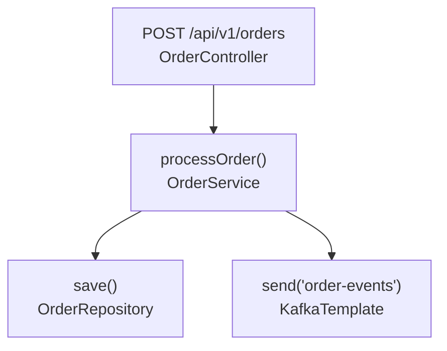

# Product Requirement Document (PRD)

## AI-Driven Reverse Engineering CLI for Spec-Driven Development (SDD)

> **Version 5.4** — Phase 2 LLM Executor (F017) uses **OpenRouter** as the AI provider via Spring AI's OpenAI-compatible client. Configurable model via `OPENROUTER_MODEL` env var (default: `deepseek/deepseek-v4-flash:free`). `.env` file loaded automatically via `spring.config.import=optional:file:.env`.

---

## 1. Executive Summary & Objectives

### 1.1 Purpose

**Spec-Driven Development (SDD)** is the architectural practice of treating a highly structured, technology-agnostic business specification—not source code—as the primary, authoritative artifact of a software project. It is the single source of truth from which automated tests, clean implementation, and functional documentation are derived.

This document specifies the requirements for a Command Line Interface (CLI) application built on the JVM ecosystem using **Spring AI (via OpenRouter)** and **Embabel**. It is designed to perform deep, automated reverse engineering on legacy enterprise codebases. The tool extracts embedded business rules, domain validations, and ecosystem invariants, consolidating them into highly structured Markdown documents organized by **"Use Cases / Functional Flows"**.

Crucially, the tool rejects direct test framework generation. Instead, it exports a markdown specification alongside a machine-readable **Semantic Manifest JSON**. This output serves as the decoupled, hyper-traceable source of truth for downstream automated processes, such as a specialized AI Skill responsible for compiling BDD **Gherkin feature files (`.feature`)** or re-architecting applications.

### 1.2 Core Objectives

* **De-technify Enterprise Code:** Abstract dense, legacy technical implementations (Java/Spring, SQL procedural logic, state frameworks) into clear business intentions, process parameters, and edge cases.
* **Eradicate Context Rot & Hallucinations:** Enforce a stateless, short-lived execution pattern with absolute context isolation per file to maximize LLM analytical accuracy.
* **Provide End-to-End Visibility:** Connect scattered functional points, bridging frontend interactions, synchronous REST endpoints, asynchronous event topologies, and hidden procedural database layers.
* **Provide a Standard Data Contract for Test Generation:** Output predictable, structured semantic graphs that bridge the gap between static code structures and dynamic business tests.

---

## 2. Core Architecture & Product Paradigms

The CLI rejects the unpredictable, conversational agent-loop pattern. It adopts a phased engine that transitions from deterministic compilation (Phase 1) through stateless per-file LLM enrichment (Phase 2) to an agentic, goal-oriented synthesis phase (Phase 3) powered by Embabel.

\`\`\`
[Phase 1: Deterministic Indexing] ──> [Phase 2: Semantic Enrichment] ──> [Phase 3: Agentic Functional Requirement Extraction (Embabel)]
\`\`\`

### 2.1 Phase 1: Deterministic Multi-Language Indexing

Before any LLM interaction takes place, the CLI scans the physical workspace using local code-graph and parsing tools. To maintain platform-agnostic distribution without native OS-level JNI bindings (such as Tree-sitter), the engineering stack enforces pure-Java AST parsers (e.g., **JavaParser** for Spring/Java modules). This phase runs as a deterministic compiler-pass requiring zero network connectivity or LLM credentials. It maps signatures, endpoint routes, call frameworks, and event publishers into a local intermediate contract file, eliminating structural exploration overhead during LLM execution.

To enable inter-file structural tracing without LLM dependencies, Phase 1 operates a **two-pass deterministic linker** architecture:

1. **Pass 1 — Declaration Collection:** Every source file is parsed with JavaParser to extract method signatures, field types, and component stereotypes into a global `DeclarationRegistry` held in memory. No resolution or analysis is performed — only structural registration.
2. **Pass 2 — Resolution Analysis:** Each file is re-analysed with the full visitor suite. Resolution visitors (`CallGraphVisitor`, `DbAccessVisitor`, `OutboundHttpVisitor`) resolve method calls, database access patterns, and outbound HTTP calls against the registry built in Pass 1.
3. **Post-Pass Link Resolution:** Once all files are processed, deterministic resolvers match event producers to consumers (`TopicLinkResolver`) and register outbound HTTP calls (`FloatingLinkResolver`).

This design ensures that Controller → Service → Repository / Database / External System traces are resolved without LLM calls. The LLM is reserved exclusively for semantic enrichment in Phase 2.

#### 2.1.1 Dual-Engine Indexing & Ecosystem Discovery

To maximize dependency resolution accuracy without inducing build-time hard blocks, Phase 1 operates a dual-engine indexing sequence categorized into "Static Compilation Telemetry" and "Text-Based AST Structural Parsing."

1. **Ecosystem Discovery Step (Optional / Non-Blocking):**
* At boot time, the engine checks for the presence of a build-system configuration (e.g., `pom.xml`).
* If present, the CLI spawns an isolated background OS process to execute an offline maven dependency tree evaluation:
  `mvn com.github.ferstl:depgraph-maven-plugin:4.0.3:graph -DgraphFormat=json -DoutputDirectory=.`
* If successful, the resulting artifact is ingested to pre-populate classpaths, third-party libraries, and multi-module relationships.
* **Fault-Tolerance:** If Maven is missing, the workspace lacks a repository connection, or the project is in a non-compiling state, the process must catch the failure gracefully, log an optimization warning (`"Ecosystem telemetry unavailable; proceeding with standalone heuristic mode"`), and proceed unhindered.


2. **Pure-Java AST Parsing Step (Authoritative / Mandatory):**
* Regardless of build-system state, JavaParser runs as the authoritative engine to build an in-memory Abstract Syntax Tree (AST). It handles "dirty code" (broken syntax or non-compiling files) by evaluating them directly as text streams.
* **Type Solver Fallback:** The indexer must configure JavaParser's `CombinedTypeSolver` to prioritize local source directories first. If a type cannot be resolved statically (e.g., a third-party framework or missing compiled class), the engine must gracefully switch to an **Annotation-Driven Strategy** rather than throwing a parsing exception. If a class contains methods with `@PostMapping`, it is designated as a REST entrypoint regardless of what base framework class it extends.


#### 2.1.2 AST Parsing Strategy (Java Domain)

The indexer leverages a dedicated `VoidVisitorAdapter<Context>` traversal strategy to capture four structural dimensions:

* **Component Identification & Types:** Detect classes, interfaces, and records. Identify stereotypes by inspecting class-level annotations (e.g., `@RestController`, `@Service`, `@Component`, `@Repository`).
* **Inbound Ingress Points (HTTP/Events/Scheduled):**
* *REST Endpoints (Pass 2):* Map methods annotated with `@RequestMapping`, `@PostMapping`, `@GetMapping`, etc. Extract literal path strings and HTTP verbs. Implemented via `SpringEndpointDetector` (`@Component` implementing `EndpointDetector` SPI).
* *Servlet Endpoints (Pass 2):* Map `HttpServlet` subclasses (both `javax.servlet.http.HttpServlet` and `jakarta.servlet.http.HttpServlet`). Detect `doGet`/`doPost`/`doPut`/`doDelete`/`doPatch`/`doHead`/`doTrace`/`doOptions` method names and map to HTTP verbs. Extract URL patterns from `@WebServlet` annotation (`javax.servlet.annotation.WebServlet` and `jakarta.servlet.annotation.WebServlet`). Validate method signature includes `HttpServletRequest` and `HttpServletResponse` parameters. Implemented via `ServletEndpointDetector` (`@Component` implementing `EndpointDetector` SPI). Adding a new endpoint framework (e.g., JAX-RS) requires only a new `@Component EndpointDetector` class — zero changes to the delegating `EndpointVisitor`.
* *web.xml Endpoint Discovery (Post-Pass):* After Java AST analysis, `**/web.xml` files are discovered and DOM-parsed via `WebXmlAnalyzer`. `<servlet>` elements are mapped to `<servlet-class>` and `<servlet-mapping>` elements to `<url-pattern>`, producing `EndpointInfo` entries with `httpMethod=""` (all methods) and the mapped servlet class name. No Java source modification or cross-referencing with `@WebServlet` annotations is performed — both sources produce independent `EndpointInfo` entries.
* *Event Consumers:* Map methods annotated with message broker listener frameworks:
  * *Kafka:* `@KafkaListener(topics = "...")` — extract target topics.
  * *RabbitMQ:* `@RabbitListener(queues = "...")` — extract target queues.
  * *ActiveMQ (JMS):* `@JmsListener(destination = "...")` — extract target destinations.
* *Scheduled Tasks:* Map methods annotated with `@Scheduled`. Extract cron expressions, fixed-delay, fixed-rate strings, and trigger zone.


* **Outbound Egress Points (Dependencies & Triggers):**
* *Method Invocations:* Capture method call expressions (`MethodCallExpr`) matching internal package boundaries to map deep structural call trees.
* *Event Publications:* Identify calls to event-broker templates and extract destination targets:
  * *Kafka:* `KafkaTemplate.send(topic, ...)` / `KafkaTemplate.send(topic, key, ...)`.
  * *RabbitMQ:* `RabbitTemplate.convertAndSend(exchange, routingKey, ...)` / `RabbitTemplate.send(exchange, routingKey, ...)`.
  * *ActiveMQ (JMS):* `JmsTemplate.convertAndSend(destination, ...)` / `JmsTemplate.send(destination, ...)`.
* *Unresolved References:* Outbound calls targeting signatures outside the indexed codebase or missing from the ecosystem discovery payload are caught and recorded.


* **Companion Rules & Validations:**
* *Custom Constraints:* Scan field and parameter annotations. If an annotation maps to a custom validation constraint (e.g., `@ValidOrder`), resolve its `validatedBy` target class via AST imports.

* **Inter-File Call Resolution (Pass 2):**
  * A `CallGraphVisitor` resolves each `MethodCallExpr` against the `DeclarationRegistry` built in Pass 1.
  * For calls matching internal package boundaries, the edge is recorded with source file, target file, and method signatures.
  * Overloaded methods are recorded as `AMBIGUOUS` when argument count cannot discriminate.
  * Calls to JDK (`String.*`, `List.*`), Spring framework internals, and third-party libraries not resolved by the dependency graph are recorded as `unresolved_signatures`.
  * Calls inside `@EventListener` method bodies are captured with up to 3 levels of nesting (existing behavior, now resolved against the registry).

 * **Database Access Patterns (Pass 2):**
   * Detect `JdbcTemplate.update(query, args)`, `.query(sql, ...)`, `.queryForObject(sql, ...)`.
   * Detect Hibernate Session operations: `session.save()`, `.get()`, `.load()`, `.delete()`, `.createQuery(hql)`, `.createNativeQuery(sql)`, `.byNaturalId()`.
   * Detect `@Procedure(name = "...")` on repository methods.
   * Detect `EntityManager.persist()`, `.merge()`, `.find()`, `.createQuery()`.
   * Detect `@Transactional` on method or class level as transaction boundaries (class-level deduplicated against method-level override).
   * Detect `NamedParameterJdbcTemplate` and `SimpleJdbcCall`.
   * SQL string literals are extracted from the AST; procedure names are extracted from annotation attributes; table names are inferred from SQL strings where possible.
   * Spring Data interfaces (`CrudRepository`, `JpaRepository`) are registered as **virtual declarations** — their derived query methods (e.g., `findByLastName()`) have no AST body but are recognized as database access points. Methods with `@Query` are no longer skipped — they produce findings with the query string and a `nativeQuery` flag distinguishing native SQL from JPQL/HQL.
   * Detect `@Query(value = "...", nativeQuery = true/false)` on Spring Data repository methods — extracts the query string and routes to `NATIVE_SQL` or `JPQL_HQL` type.
   * Detect `@NamedQuery(query = "...")` and `@NamedNativeQuery(query = "...")` on entity classes — individual and container (`@NamedQueries`/`@NamedNativeQueries`) forms supported. Routes to `JPQL_HQL` or `NATIVE_SQL` type respectively.
   * Detect `EntityManager.createNativeQuery(sql)` (→ `NATIVE_SQL`), `createQuery(jpql)` (→ `JPQL_HQL`), `createNamedQuery(name)` (→ `JPQL_HQL`). Non-query EM methods (`persist`, `merge`, `find`, etc.) remain `ENTITY_MANAGER`.
   * Detect `Session.createNativeQuery(sql)` and `Session.createSQLQuery(sql)` (→ `NATIVE_SQL`), `Session.createQuery(hql)` (→ `JPQL_HQL`). Non-query Session methods (`save`, `get`, `delete`, etc.) remain `HIBERNATE_SESSION`.
   * Detect raw JDBC calls: `Connection.prepareStatement(sql)` / `prepareCall(sql)` on `connection`/`conn` scope; `Statement.executeQuery(sql)` / `executeUpdate(sql)` / `execute(sql)` / `executeLargeUpdate(sql)` / `addBatch(sql)` on any scope with a string first argument (→ `NATIVE_SQL`).
   * Each detection path is implemented as a standalone `DbAccessDetector` component wired via Spring DI — adding a new database technology requires only a new class with zero changes to existing detector code.

* **Outbound HTTP Client Patterns (Pass 2):**
  * Detect `RestTemplate.getForObject(url, ...)`, `.postForObject(url, ...)`, `.exchange(url, method, ...)`, `.put()`, `.delete()`.
  * Detect `WebClient` fluent builder chains: `.method(HttpMethod.GET).uri(url).retrieve()`, `.get().uri(url).retrieve()`, `.post().uri(url).retrieve()`.
  * Detect `@FeignClient(name = "...", url = "...")` on interfaces with method-level `@GetMapping`, `@PostMapping`, etc.
  * Detect `RestClient` (Spring 6.1) fluent chains: `.get().uri(url)`, `.post().uri(url)`, `.put().uri(url)`, `.delete()`.
  * Detect `@HttpExchange` / `@GetExchange` / `@PostExchange` / `@PutExchange` / `@DeleteExchange` on interfaces (Spring 6).
  * Detect `java.net.http.HttpClient.send(request, handler)` and `.sendAsync(request, handler)` with `HttpRequest.newBuilder().uri(url)`.
  * Detect legacy `HttpURLConnection` via `url.openConnection()`, `.setRequestMethod()`, `.connect()`.
  * Detect Apache `HttpClient` / `HttpComponents` via `new HttpGet(url)`, `new HttpPost(url)`, `new HttpPut(url)`, `new HttpDelete(url)`, and `CloseableHttpClient.execute()`.
  * Detect OkHttp via `OkHttpClient.newCall(request)` with `Request.Builder().url(url).get()/.post()/.put()/.delete()`.
  * URL literals are captured as-is; SpEL expressions and environment variable references (e.g., `${services.url}/api/v1/orders`) are captured as patterns with an `isExpression` flag.
  * Each detected call is registered as a `floating_link` in the SQLite store.

* **View-Returning Controller Detection (Pass 2):**
  * Detect controller methods returning `ModelAndView`, `String` (logical view name), `View`, or `void` (with implicit view from request path).
  * Each endpoint is tagged with `servesView: true` and the extracted `viewName`.
  * Methods in `@RestController` classes or annotated with `@ResponseBody` are excluded (they return serialized data, not views).

* **Template File Parsing (Post-Pass):**
  * After Java AST analysis completes, template files (`.jsp`, Thymeleaf `.html`) are discovered and parsed to extract frontend-to-backend HTTP references.
  * **JSP Form Detection:** Extract `<form action="..." method="...">` — capture HTTP method, URL pattern, and field names from `<input name="...">`.
  * **JSP Link Detection:** Extract `<a href="...">` anchor links.
  * **Thymeleaf Form Detection:** Extract `<form th:action="@{...}" th:method="...">` — capture HTTP method, Thymeleaf expression URL pattern, and field names.
  * **Thymeleaf Link Detection:** Extract `<a th:href="@{...}">` anchor links.
  * SpEL expressions in Thymeleaf `@{...}` paths are captured with an `isExpression` flag.
  * Each form/link is recorded as a `TemplateFormInfo` finding with the template file path, HTTP method, URL pattern, and field names.

* **Template-to-Endpoint Floating Link Resolution (Post-Pass):**
  * After template parsing, form action URLs are matched against known controller `EndpointInfo` paths.
  * Exact literal matches are linked with confidence 1.0; path-parameterized matches (e.g., `/owners/{ownerId}` ↔ form action `/owners/5`) at confidence 0.8.
  * Matched pairs are registered as `template_endpoint_links` in the index output, enabling end-to-end frontend-to-backend traceability.

#### 2.1.3 The Intermediate Boundary: `code-graph-index.json`

The indexer flushes its in-memory graph into a standardized local JSON file saved in the execution root. This serves as an un-decoupled debugging boundary for developers and provides an extensible plugin path for other language processors in future iterations.

```json
{
  "version": "1.0",
  "generated_at": "2026-07-02T12:00:00",
  "targets": [
    {
      "name": "order-management",
      "endpoints": [
        {
          "httpMethod": "GET",
          "path": "/api/v1/orders",
          "controllerName": "OrderController",
          "methodName": "listOrders",
          "pathVariables": [],
          "queryParameters": [],
          "filePath": "src/main/java/com/acme/orders/controller/OrderController.java",
          "servesView": false,
          "viewName": "",
          "requestBodies": [],
          "startLine": 0,
          "endLine": 0
        }
      ],
      "components": [
        {
          "annotationType": "RestController",
          "className": "OrderController",
          "packageName": "com.acme.orders.controller",
          "filePath": "src/main/java/com/acme/orders/controller/OrderController.java"
        }
      ],
      "scheduled_tasks": [],
      "event_listeners": [],
      "event_publishers": [],
      "validators": [],
      "kafka_listeners": [],
      "kafka_publishers": [],
      "bean_methods": [],
      "rabbitmq_listeners": [],
      "rabbitmq_publishers": [],
      "activemq_listeners": [],
      "activemq_publishers": [],
      "xml_beans": [],
      "database_access": [
        {
          "className": "OrderRepository",
          "methodName": "findAll",
          "filePath": "src/main/java/com/acme/orders/repository/OrderRepository.java",
          "accessType": "JPA_REPOSITORY",
          "type": "JPA_REPOSITORY",
          "sql": "",
          "startLine": 0,
          "endLine": 0
        }
      ],
      "xml_component_scans": [],
      "xml_aop_configs": [],
      "xml_namespace_beans": [],
      "call_graph_edges": [
        {
          "sourceClassName": "OrderController",
          "sourceMethodName": "listOrders",
          "sourceFilePath": "src/main/java/com/acme/orders/controller/OrderController.java",
          "targetClassName": "OrderService",
          "targetMethodName": "findAll",
          "targetFilePath": "src/main/java/com/acme/orders/service/OrderService.java",
          "argCount": 0,
          "resolvedStatus": "RESOLVED",
          "ambiguousCandidates": [],
          "targetStartLine": 0,
          "targetEndLine": 0
        }
      ],
      "outbound_http_calls": []
    }
  ],
  "topic_links": [],
  "template_endpoint_links": [],
  "floating_links": []
}
```

The output is organized by manifest scan target. Each target contains typed arrays of analysis findings: components, endpoints, call graph edges, database accesses, event listeners/publishers, scheduled tasks, validators, Kafka/RabbitMQ/ActiveMQ bindings, bean methods, XML configuration, and template forms. Cross-cutting link registrations (topic links, floating links, template-to-endpoint matches) are stored at the root level. Per-file metadata such as content hash, status, and test pairing is stored in the SQLite `tasks` table rather than the JSON index.

#### 2.1.4 Secret Redaction Gate

A mandatory, pre-LLM pipeline interceptor scans code using an embedded open-source secret scanning core abstraction (e.g., Gitleaks/TruffleHog shared signature mechanics). Passwords, hardcoded credentials, and API literals are replaced in-memory with a stable placeholder (e.g., `[REDACTED:secret_type]`). The physical file on disk remains completely untouched.

#### 2.1.5 Exclusion of Code Patterns

Third-party vendor packages, generated code stubs, and build artifacts matching the manifest's `exclude_patterns` are dropped immediately, protecting the execution matrix from scope bloat.

#### 2.1.6 SQLite Ingestion Pipeline

Immediately after Pass 2 resolution completes, the indexer persists all findings to the SQLite store. For each file, a `tasks` row is created or updated. For each call graph edge, a row is inserted into `execution_findings` with the `resolved` column set per-finding via `AnalysisFinding.isResolved()` — unresolved edges receive `resolved=0`. Topic links, floating links, and metrics are written to their respective tables. A re-classification step then creates additional `execution_findings` rows with granular finding types (`SPRING_DATA_INTERFACE`, `DATABASE_PROCEDURE_CALL`, `CONSTRAINT_VALIDATOR`, `NATIVE_SQL_QUERY`, `JPQL_HQL_QUERY`) so the Phase 2 Planner can qualify files via clean SQL queries without JSON deserialization.

```sql
INSERT INTO tasks (
    task_id, file_path, status, content_type, content_hash,
    target_name, paired_test_path, created_at, updated_at
) VALUES (
    ?, -- SHA-256: target_name | file_path | sha256(content)
    ?, -- file_path
    'PENDING', -- Initial State
    ?, -- content_type (e.g. 'java', 'jsp')
    ?, -- content_hash
    ?, -- target_name — the manifest target this file belongs to
    ?, -- paired_test_file (nullable)
    datetime('now'), -- created_at
    datetime('now')  -- updated_at
);

```

*Idempotency Rule:* The database insert loop must handle existing keys by validating hashes or dropping/recreating stale pending tasks to allow smooth re-indexing commands.

**Complete SQLite Schema:**

```sql
CREATE TABLE IF NOT EXISTS tasks (
    task_id         TEXT PRIMARY KEY,
    file_path       TEXT NOT NULL,
    status          TEXT NOT NULL DEFAULT 'PENDING',
    content_type    TEXT,
    content_hash    TEXT NOT NULL,
    target_name     TEXT NOT NULL DEFAULT '',
    paired_test_path TEXT,
    created_at      TEXT NOT NULL DEFAULT (datetime('now')),
    updated_at      TEXT NOT NULL DEFAULT (datetime('now'))
);

CREATE TABLE IF NOT EXISTS execution_findings (
    id              INTEGER PRIMARY KEY AUTOINCREMENT,
    task_id         TEXT NOT NULL REFERENCES tasks(task_id),
    finding_type    TEXT NOT NULL DEFAULT 'UNKNOWN',
    finding_json    TEXT NOT NULL,
    resolved        INTEGER NOT NULL DEFAULT 1,
    schema_version  TEXT NOT NULL DEFAULT '1.0',
    created_at      TEXT DEFAULT (datetime('now'))
);

CREATE TABLE IF NOT EXISTS topic_links (
    id              INTEGER PRIMARY KEY AUTOINCREMENT,
    broker          TEXT NOT NULL,
    topic_or_queue  TEXT NOT NULL,
    producer_task_id TEXT REFERENCES tasks(task_id),
    consumer_task_id TEXT REFERENCES tasks(task_id),
    resolved_status TEXT NOT NULL DEFAULT 'PENDING',
    confidence      REAL DEFAULT 1.0,
    created_at      TEXT DEFAULT (datetime('now'))
);

CREATE TABLE IF NOT EXISTS floating_links (
    id              INTEGER PRIMARY KEY AUTOINCREMENT,
    method          TEXT NOT NULL,
    url_or_path     TEXT NOT NULL,
    is_expression   INTEGER NOT NULL DEFAULT 0,
    source_task_id  TEXT NOT NULL REFERENCES tasks(task_id),
    client_type     TEXT NOT NULL DEFAULT 'UNKNOWN',
    source_method   TEXT,
    target_endpoint TEXT,
    confidence      REAL,
    resolved_status TEXT NOT NULL DEFAULT 'PENDING',
    created_at      TEXT NOT NULL DEFAULT (datetime('now'))
);

CREATE TABLE IF NOT EXISTS metrics (
    id              INTEGER PRIMARY KEY AUTOINCREMENT,
    run_id          TEXT NOT NULL,
    phase           INTEGER NOT NULL DEFAULT 1,
    tasks_total     INTEGER DEFAULT 0,
    tasks_completed INTEGER DEFAULT 0,
    edges_resolved  INTEGER DEFAULT 0,
    edges_unresolved INTEGER DEFAULT 0,
    topic_links_resolved INTEGER DEFAULT 0,
    floating_links_registered INTEGER DEFAULT 0,
    tokens_consumed INTEGER DEFAULT 0,
    api_cost_estimated REAL DEFAULT 0.0,
    recorded_at     TEXT NOT NULL DEFAULT (datetime('now'))
);
```

#### 2.1.7 Developer Implementation Checklist: Phase 1

* [ ] Implement `project-manifest.yaml` parsing.
* [ ] Integrate optional non-blocking `depgraph-maven-plugin` execution step.
* [ ] Integrate **JavaParser** core engines without native OS wrapper layers.
* [ ] Configure `CombinedTypeSolver` with annotation fallback heuristic behavior.
* [x] Implement `EndpointDetector` SPI + `SpringEndpointDetector` + `ServletEndpointDetector` (OCP-friendly pluggable detector interface, covers both Spring MVC and Servlet-based endpoints).
* [ ] Implement `unresolved_signatures` collection inside the traversal visitor.
* [ ] Create the Secret Redaction pipeline filter (in-memory swapping of hardcoded strings to `[REDACTED:secret_type]`).
* [ ] Output a structurally valid `code-graph-index.json` file.
* [ ] Write the Spring JDBC ingestion loop to transform JSON entities into `PENDING` relational rows inside SQLite, applying `PRAGMA journal_mode=WAL;`.
* [ ] Implement `GlobalDeclarationRegistry` (Pass 1 collector).
* [ ] Implement `CallGraphVisitor` (Pass 2 method call resolver).
* [ ] Implement `DbAccessVisitor` + `DbAccessDetector` SPI (Pass 2 database access patterns, OCP-friendly pluggable detector interface).
* [x] Implement `OutboundHttpVisitor` + 9 `HttpClientDetector` implementations (Pass 2 outbound HTTP calls for RestTemplate, WebClient, FeignClient, RestClient, @HttpExchange, java.net.http.HttpClient, HttpURLConnection, Apache HttpClient, OkHttp).
* [ ] Implement `TopicLinkResolver` (post-pass producer&#8596;consumer matching).
* [ ] Implement `FloatingLinkResolver` (post-pass URL&#8596;endpoint matching).
* [ ] Implement `execution_findings`, `topic_links`, `floating_links`, `metrics` tables with extended columns.
* [ ] Update `IndexWriter` with new finding types and link sections.
* [ ] Add metrics collector for edges, topic links, floating links counts.

### 2.1.8 Task State Machine

The following state machine governs task lifecycle across all phases. Each transition represents a CLI command:

```
                         scan
      PENDING ──────────────────────► INDEXED
         ▲                              │
         │                            plan
         │                              │
         │                         ┌────┴────┐
         │                         ▼         ▼
         │                    ENRICH_     SKIPPED
         │                    PENDING
         │                         │
         │                       enrich
         │                         │
         │                    ┌────┴────┐
         │                    ▼         ▼
         │                ENRICHED   ENRICH_FAILED
         │                    │
         │                  extract
         │                    │
         │                    ▼
         │             (spec output)
         │
         ├──── scan --resume ──► INDEXED ──┐
         │      (from FAILED)               │
         │                                  │
         ├──── enrich --resume ──► ENRICH_  │
         │      (from ENRICH_FAILED)   PENDING
         │                                  │
         └──── clean ───────────────────────┘
```

The planner evaluates INDEXED tasks and transitions qualified ones to `ENRICH_PENDING` and non-qualified ones to `SKIPPED`. The `SKIPPED` state distinguishes tasks that have been evaluated but did not meet enrichment criteria from tasks that have not yet been evaluated (INDEXED). This prevents redundant planner evaluation and provides clear visibility into why a task was skipped.

---

### 2.2 Phase 2: Semantic Enrichment (LLM-Scoped)

The structural trace produced by Phase 1 resolves all deterministic call paths (Controller &#8594; Service &#8594; Repository, database access, event flows, outbound HTTP calls). Phase 2 enriches this structural trace with **business semantics** for patterns that cannot be inferred from AST analysis alone.

* **The Planner:** Uses the resolved call graph and SQLite topic/floating links from Phase 1 to identify files requiring semantic enrichment. A file qualifies for Phase 2 if any of these conditions are met:
  * It has more than `llm-unresolved-threshold` (default: 5) unresolved signatures.
  * It is a Spring Data interface (no AST body to analyse).
  * It contains a stored procedure call with a body flagged for LLM interpretation.
  * It is a custom `ConstraintValidator` with a complex `isValid` body.
  * Test file assertions require semantic extraction (see §3.4).
  * It has unresolved floating links — outbound HTTP calls where `FloatingLinkResolver` could not match a target endpoint (`floating_links.resolved_status = 'PENDING'`). The LLM infers the external service's business purpose from method name, parameter structure, and call-site context.
  * It has a scheduled task (`@Scheduled` annotation) — the cron/fixed-delay expression conveys *when* but not *what* business operation the method performs.
  * It contains a native SQL query (`@Query(nativeQuery=true)`, `@NamedNativeQuery`, `EntityManager.createNativeQuery()`, `Session.createNativeQuery()/createSQLQuery()`, or raw JDBC `Connection.prepareStatement()`/`Statement.executeQuery()`) — native SQL strings encode database-specific business logic that cannot be inferred from AST structure alone.
  * It contains a JPQL/HQL query (`@Query(...)`, `@NamedQuery`, `EntityManager.createQuery()`, `Session.createQuery()`) — custom query strings encode business rules and filtering logic beyond what Spring Data derived method names convey.
  
  Qualification rules are individually togglable via the `llm-qualification-rules` array in the manifest. All rules are enabled by default. The planner is a pure rule engine — zero LLM calls are made during the qualification phase.

* **The Centralized Lightweight State Store:** An embedded SQLite database managed via high-performance, low-overhead native **Spring JDBC (JdbcTemplate)** instead of an ORM framework. It tracks enriched findings alongside the Phase 1 structural data.

* **The Executors:** Short-lived, isolated software workers configured as native Spring beans. Each Executor receives a `ThreadPoolTaskExecutor` bean (injected via `@Qualifier("orchestratorTaskExecutor")`) and wraps each unit of work in a `CompletableFuture` submitted via `taskExecutor.execute(work)`. This provides fine-grained control over retry, timeout, and error handling per enrichment call. Each Executor receives **the pre-resolved structural context** from Phase 1 (its own call graph edges, database accesses, and link registrations) plus the raw source file. The LLM prompt explicitly instructs the model to NOT resolve structural dependencies (those are already complete) and to focus only on:
  * Business purpose description (1&#8211;2 sentences per method).
  * Implicit validation rules not captured by annotations.
  * Inferred SQL for Spring Data derived query methods.
  * Business logic interpretation of stored procedures.
  * Edge cases extracted from test file assertions.

  **LLM Provider:** Executors route through **OpenRouter** (`https://openrouter.ai/api/v1`) using Spring AI's OpenAI-compatible client. The model is configured via the `OPENROUTER_MODEL` environment variable (default: `deepseek/deepseek-v4-flash:free`). API credentials are provided via `OPENROUTER_API_KEY`.

* **The Orchestrator:** Processes the enrichment DAG, submits tasks asynchronously to the Spring pool, and tracks progress via `CompletableFuture<ExecutionFinding>` responses. The enriched `ExecutionFinding` JSON (§4) is merged with the Phase 1 structural data in the SQLite store.

* **Phase Synchronization Barrier:** Phase 3 (synthesis) is blocked until ALL Phase 2 enrichment tasks complete, using `CompletableFuture.allOf(...)`. Phase 2 is skipped entirely if `--llm-threshold` is set to 0 or no files qualify.
* **FAILED Task Recovery:** Tasks that exhaust retries and transition to FAILED can be recovered by resetting the task status to INDEXED via `task-set-status --task <id> --status INDEXED --delete-findings true` and re-running; the planner skips tasks that already have a SEMANTIC_ENRICHMENT finding, so only truly failed tasks are re-processed. Or use `enrich --resume` for full crash recovery.
  **Authentication:** LLM requests are authenticated via `OPENROUTER_API_KEY` environment variable (loaded from `.env` via `spring.config.import=optional:file:.env`).

---

### 2.3 Phase 3: Entry-Point-Driven Agentic Functional Requirement Extraction (Embabel)

Phase 3 takes the enriched codebase (Phase 1 structural data + Phase 2 semantic enrichment) and employs an **Embabel GOAP agent** to extract holistic functional requirements by **tracing execution flows from entry points**. The agent discovers entry points (HTTP endpoints, @Scheduled, @KafkaListener, etc.), traces the execution flow through the call graph (Controller -> Service -> Repository), and for each flow extracts user stories, Gherkin acceptance criteria, business rules, and edge cases.

The agent requires `embabel-agent-starter` (core GOAP engine) on the classpath.

**The Embabel Agent:**

1. **Goal:** Extract complete, coherent functional requirements (user stories, Gherkin scenarios, business rules, edge cases) from the combined structural + enriched corpus. The agent terminates when all entry points have been traced and analyzed, or unresolvable gaps are flagged for human review.

2. **Initial Knowledge (`CodebaseKnowledge` domain model):** Before the agent runs, a pure-Java orchestrator aggregates two sources into an in-memory domain model:
   - **Phase 1 structural data:** call graph edges, topic links, floating links, endpoint registries, database access patterns.
   - **Phase 2 enriched data:** per-file `ExecutionFinding` records (business purpose, validations, edge cases, test insights).
   
   This aggregate is placed on the Embabel blackboard as the agent's initial working memory — the agent never queries SQLite directly. Actions read from and write to the blackboard, setting world-state conditions that drive GOAP planning.

3. **Actions (pluggable, GOAP-scheduled via world-state conditions):**
   - `DiscoverEntryPoints` — Scan `CodebaseKnowledge` for all entry points (HTTP endpoints, @Scheduled, @KafkaListener, @RabbitListener, @JmsListener, @EventListener). Score each by priority and filter trivial endpoints (actuator, health, metrics).
   - `TraceFlow` — For the highest-priority unscheduled entry point, follow call graph edges through the codebase. Build a `FlowStep` list tracing from entry point through services to repositories. Adaptive depth — agent decides when to stop based on complexity.
   - `AnalyzeFlow` — For a traced flow, extract business semantics: user story, Gherkin scenarios, business rules, edge cases. Uses Phase 2 enrichment as context, raw source for gaps.
   - `GroupFlows` — After analyzing multiple flows, cluster related flows into features using semantic similarity (e.g., GET/POST /orders -> "Order Management").
   - `CrossReferenceFlows` — Resolve inter-flow dependencies (Order flow -> Payment flow). Match floating HTTP calls and topic publications to known endpoints.
   - `SynthesizeSpec` — Aggregate all analyzed and grouped flows into the final Markdown + JSON output.
   - `QuarantineFlow` — When a flow cannot be fully resolved (exceeds investigation budget, low confidence), flag it for human review.
   
   Each action declares preconditions and postconditions as world-state condition identifiers. The GOAP planner uses these to determine action ordering and goal satisfaction.

4. **Dynamic Re-Planning (GOAP):** After each action, the Embabel planner reassesses goal completion. If ambiguity remains, it replans the next action sequence. The planner uses a non-LLM GOAP algorithm; LLM calls are reserved for individual actions that require semantic analysis.

5. **Flow Priority Scoring:** Each entry point receives a priority score (0.0-1.0) that determines tracing order:
   - Phase 2 enrichment exists (+0.3) — cheaper to analyze
   - Complex downstream calls (+0.3) — more likely to contain business logic
   - User-facing endpoint (+0.2) — more important than internal tasks
   - Test file exists (+0.2) — provides additional context

6. **Sub-Chain Caching:** When tracing a flow, the agent checks if a shared sub-chain already exists. If `OrderService.processOrder()` was already traced by `POST /orders`, reuse it for `GET /orders`. This avoids redundant tracing.

7. **Orphaned Method Detection:** After tracing all entry points, the agent identifies methods that are called but NOT reachable from any entry point. These are flagged as potential dead code or missing entry points.

8. **Progressive Disclosure:** The agent decides output granularity per flow based on complexity:
   - **Minimal** (score < 0.3): 1-line description, 1 user story, 1 Gherkin scenario
   - **Standard** (0.3-0.7): User story, 2-3 Gherkin scenarios, business rules matrix
   - **Full** (>= 0.7): User story, multiple Gherkin scenarios, business rules, edge cases, traceability table, Mermaid diagram

9. **Guardrails & Model Configuration (via `application.properties`):**
   - `embabel.models.default-llm` — Default model for Embabel agent actions.
   - `embabel.models.llms.cheapest` — Budget model for cost-sensitive actions.
   - `embabel.models.llms.best` — High-quality model for critical synthesis steps.
   - `max-flow-depth` (default: 5) — Maximum call chain depth per flow.
   - `max-tokens-per-run` (default: 500000) — Hard token budget for Phase 3 LLM calls.
   - `ambiguity-confidence-threshold` (default: 0.7) — Below this threshold, the flow is marked `AWAITING_HUMAN_REVIEW`.

10. **Termination:** When all entry points have been traced and analyzed, or unresolvable gaps are quarantined, the agent finalizes. A pure-Java writer then produces the output artifacts (Markdown + JSON).

**Design Principle — Separation of Concerns:**
- **Pure Java services** (non-agentic) handle: loading data from SQLite, assembling `CodebaseKnowledge`, writing output files.
- **Embabel agent** handles only: deciding what to investigate next, calling actions, tracking goal completion.
- This keeps the agent focused, testable, and cheap (GOAP planning uses no tokens).

**Why entry-point-driven?** Previous design grouped findings by "boundary" which assumed the boundaries were known. In legacy codebases, the actual execution flows are unknown until traced. Starting from entry points and following the call graph discovers the real flows, including unexpected paths and orphaned methods.

---

### 2.4 SQLite Core: Concurrency, State Management, and Fault Tolerance

To ensure high-performance concurrent processing locally without requiring a dedicated external database server, the embedded persistence layer must be configured to eliminate database locking errors (`database is locked`) while permitting true concurrent reading operations.

1. **Write-Ahead Logging (WAL) Mode:** The JDBC engine must enforce `PRAGMA journal_mode=WAL;`. This permits concurrent reading threads (such as the Orchestrator traversing the DAG or logging metrics) to execute completely unhindered by writing threads (Executors committing async results).
2. **Busy Timeout Queueing:** The connection must initialize with `PRAGMA busy_timeout=5000;`. If multiple execution threads attempt to write to disk simultaneously, the secondary threads will pause and queue gracefully for up to 5000ms instead of throwing immediate transactional exceptions.
3. **Connection Pool Concurrency Alignment:** To fully utilize WAL mode without deadlocks, the system configures a pooled approach allowing concurrent reads while serializing writes where necessary. The connection pool size is opened to a maximum of 10 (`maximum-pool-size=10`), leveraging `PRAGMA synchronous=NORMAL;` to balance disk write safety with rapid local parallel processing across multiple threads.

---

## 3. Functional Requirements

### 3.1 Multi-Repository Manifest Configuration

The CLI must ingest an external `project-manifest.yaml` configuration file to govern scanning scopes across distributed microservices, mono-repos, or multi-repo structures.

**Example manifest contract:**

```yaml
targets:
  - name: order-management-service
    path: ./repos/order-service
    layer: backend
    tech_profile: java-spring-legacy
    entry_points:
      - src/main/java/com/acme/orders/controller/OrderController.java
    exclude_patterns:
      - "**/generated/**"
      - "**/*Pb.java"
```

### 3.2 Full-Stack Flow Stitching (Floating Links)

The application must trace execution pathways across network boundaries.

**Phase 1 (Deterministic):** The `OutboundHttpVisitor` detects outbound HTTP calls from `RestTemplate`, `WebClient`, `@FeignClient`, `RestClient` (Spring 6.1), `@HttpExchange` (Spring 6), `java.net.http.HttpClient`, `HttpURLConnection`, Apache `HttpClient`, and OkHttp declarations. Each call is registered as a `floating_link` in the SQLite store with its HTTP method, URL pattern (literal or expression), and source file task ID. After all files are processed, the `FloatingLinkResolver` performs deterministic matching using a scoring system (method match + path match + parameter match). Literal string URLs matching a known backend endpoint (same HTTP method + path) receive confidence **1.0** (score ≥ 0.9). URLs with path variables or query parameters matching structural patterns receive confidence **0.8** (score ≥ 0.7), **0.6** (score ≥ 0.5), or **0.4** (score ≥ 0.3). A separate prefix-match rule also assigns **0.4** when a URL prefix matches a known endpoint path. Unresolved links remain `PENDING` for optional Phase 2 semantic enrichment, where the LLM can infer the intended target from method name, payload structure, and endpoint descriptions.

**Phase 2 (Planner):** Files with unresolved floating links (`floating_links.resolved_status = 'PENDING'`) qualify for LLM enrichment. The LLM receives the HTTP method, URL pattern, and call-site context (surrounding method, parameters) and infers the external service's business purpose — e.g., `POST ${payment.service.url}/api/v1/charges` → "Delegates payment processing to the external Payment Service; expects a charge response."

### 3.3 Asynchronous Message & Scheduled Trigger Tracing (Topic & Scheduled Links)

The system must bridge decoupling gaps created by event-driven and time-driven patterns.

**Phase 1 (Deterministic):** When a visitor identifies a message dispatcher block (e.g., `KafkaTemplate.send("order-topic", ...)`), it registers the publication in the analysis result. After all files are processed, the `TopicLinkResolver` performs a deterministic SQL JOIN across all scanned targets: it matches `broker` + `topic_or_queue` values between producers and consumers. For each matching pair, a `topic_link` row is created with status `RESOLVED`. This covers Kafka, RabbitMQ, and ActiveMQ/JMS flows within the same manifest execution.

Methods annotated with `@Scheduled` are traced as time-based inbound triggers; their schedule metadata is captured and linked to the business operations they initiate via the call graph resolved in Pass 2.

**Phase 2 (Planner):** Files with `@Scheduled` findings qualify for LLM enrichment. The LLM receives the cron/fixed-delay/fixed-rate expression plus the method body and infers the business operation — e.g., `0 0 2 * * ?` invoked on `purgeExpiredSessions()` → "Runs daily at 2 AM to purge expired user sessions; prevents session table bloat."

### 3.4 Test Suite Mining (Assertion Extraction)

To capture intended validations that may be obscured by technical debt in production classes, the Planner matches production files with their corresponding test files (e.g., `OrderService.java` paired with `OrderServiceTest.java`). The Executor processes both files concurrently, translating assertions (`assertEquals`, `assertThrows`, `expect()`) into functional edge cases and validation requirements.

### 3.5 Dynamic Re-Planning Loop & Phase 2 Threshold

If an Executor uncovers an unindexed runtime dependency during LLM file analysis (such as dynamic reflections or factory class routing), it attaches a `discovered_dependency` array to its JSON output.

* **Branch Isolation:** The Orchestrator pauses execution **only for that specific branch**, registers the new file tasks into the SQLite store as `PENDING`, updates task priorities, and triggers them asynchronously. Other branches of the DAG continue running completely uninterrupted.
* **Phase 2 Threshold Guard:** The Phase 1 linker does not perform dynamic re-planning. If a deterministic resolution fails (unresolved signature), it is logged and counted. Only when the unresolved count per file exceeds `llm-unresolved-threshold` (default: 5) does the file qualify for Phase 2 enrichment.
* **Phase Synchronization Barrier:** To prevent Phase 3 (Map-Reduce consolidation) from building partial or corrupted system maps, a strict execution barrier is enforced via Spring-managed completion frameworks. The engine is completely blocked from initiating Phase 3 if *any* task in the state store is flagged as `PENDING`, `ENRICH_PENDING`, or `ENRICHING`. Using `CompletableFuture.allOf(...)`, synthesis only triggers when all futures across all branches have completed successfully and resolved.

  The `run` command also enforces fail-stop guards between each phase:
  - **After scan:** if any tasks are `FAILED`, execution halts with a suggestion to run `scan --resume`.
  - **After plan:** if 0 tasks qualified for enrichment (`ENRICH_PENDING == 0`), execution halts — nothing to enrich.
  - **After enrich:** if any tasks remain `ENRICH_FAILED`, execution halts with a suggestion to run `enrich --resume`.

### 3.6 Automated Constraint Extraction & Context Budgeting

To capture domain rules enforced via custom framework validations without breaking file context boundaries or overflowing LLM processing windows:

1. **Static Analysis Mapping:** During Phase 1, the indexer identifies interfaces annotated with custom constraints (e.g., `@jakarta.validation.Constraint` or `@javax.validation.Constraint`) and maps them to their respective physical implementation classes via the `validatedBy` attribute.
2. **Logic Slicing:** When a production class utilizing a custom validation annotation is queued for an Executor, the Orchestrator extracts **only the internal body of the matching `public boolean isValid(...)` method**.
3. **Context Budgeting Protocol:** Before compiling the final Executor prompt, the system calculates the combined token weight of the target source file, its test file, and any extracted custom constraint slices using the model's explicit tokenization engine (e.g., Tiktoken for OpenAI, Anthropic Tokenizer for Claude). If the total token count exceeds 80% of the model's native context window, the system bypasses direct raw inclusion and triggers an intermediate, highly dense LLM semantic pre-summarization step for the companion logic slices before attaching them to the prompt under the `### COMPANION CUSTOM VALIDATORS` section.

### 3.7 Database Logic Processing

Legacy architectures often hide critical business logic inside procedural database entities, bypassing basic source file analysis.

**Phase 1 — Structural Detection:**

1. **DDL Source Collection:** The CLI ingests database schemas by monitoring Flyway/Liquibase migration directories or accepting a manual file dump using the `--db-schema` parameter.
2. **Persistence Mapping (Deterministic):** When source code files declare native procedure calls (`@Procedure` annotations or explicit `CALL / EXECUTE` blocks), the `DbAccessVisitor` extracts the procedure name and registers a `DATABASE_PROCEDURE_CALL` egress point. If DDL sources are available, the matching `CREATE PROCEDURE` or `CREATE FUNCTION` block is extracted and associated with the call.
3. **SQL String Extraction:** JDBC template invocations with inline SQL strings are captured as `DATABASE_CALL` egress points with the SQL literal and any inferable table reference.
4. **Spring Data Virtual Declarations:** Repository interfaces extending `CrudRepository` or `JpaRepository` are registered as virtual database access points. Derived query methods (e.g., `findByLastName()`) are recorded with their inferred entity type.

**Phase 2 — Semantic Interpretation (when needed):**

5. **Syntax Fallback Gateway:** If the local static DDL parser fails to isolate the procedure body due to vendor-specific SQL extensions or complex non-ANSI legacy schemas, the raw schema segment is delegated to an LLM text-cleaning pass.
6. **Semantic Deserialization:** The procedural SQL code block is sent to the LLM Executor which converts database constructs into standardized functional definitions:
* Internal `RAISE_APPLICATION_ERROR` signals or exception states map to **Business Rejection Rules** (`validations`).
* Cursor loops (`CURSOR + LOOP`) map to structural processing steps or collection groupings.
* Database transaction controls (`COMMIT / ROLLBACK`) map to functional **Edge Cases** (`edge_cases`).


### 3.8 Embabel Agentic Functional Requirement Extraction

Phase 3 employs Embabel's **Goal-Oriented Action Planning (GOAP)** to dynamically trace execution flows from entry points and extract functional requirements. This is fundamentally different from a fixed pipeline: the agent decides *what entry point to trace next* based on current knowledge and remaining ambiguity.

**Agent Structure:**

- **`@Agent(name = "functional-requirement-extractor", description = "Trace execution flows from entry points and extract functional requirements", planner = GOAP, scan = true)`** — The top-level agent for Phase 3, deployed via Embabel's annotation scanning.
- **Domain Model:** `CodebaseKnowledge` (aggregate), `EntryPoint`, `ExecutionFlow`, `FlowStep`, `FunctionalFlow`, `FunctionalFeature`, `GherkinScenario`, `BusinessRule`, `EdgeCase`, `FlowRelationship`, `AmbiguityGap`, `OrphanedMethod` — strongly-typed objects that flow between actions.
- **Actions:**
  - `DiscoverEntryPoints` — Scan for all entry points (HTTP endpoints, @Scheduled, @KafkaListener, @RabbitListener, @JmsListener, @EventListener). Score by priority, filter trivial.
  - `TraceFlow` — For the highest-priority unscheduled entry point, trace call graph edges and build an execution flow with adaptive depth and sub-chain caching.
  - `AnalyzeFlow` — Extract business semantics from traced flow: user story, Gherkin scenarios, business rules, edge cases.
  - `GroupFlows` — Cluster related flows into features using semantic similarity from Phase 2 enrichment.
  - `CrossReferenceFlows` — Resolve inter-flow dependencies (HTTP calls, topic events between flows).
  - `SynthesizeSpec` — Aggregate all resolved knowledge into the final Markdown + JSON specification.
  - `QuarantineFlow` — Flag flows that cannot be completed after exhausting investigation budget; set to `AWAITING_HUMAN_REVIEW`.
- **Conditions:** Each action declares preconditions and postconditions as world-state condition identifiers (e.g., `entry_points_discovered = true` enables `TraceFlow`; `flows_grouped = true` enables `SynthesizeSpec`). Conditions are managed on the Embabel blackboard and drive the GOAP planner's action chaining automatically.

**Improvements over previous design:**
- **Flow Priority Scoring:** Entry points are scored by enrichment availability, complexity, user-facing status, and test file presence. High-priority flows are traced first.
- **Sub-Chain Caching:** Shared service chains are reused across related entry points, avoiding redundant tracing.
- **Orphaned Method Detection:** Methods unreachable from any entry point are flagged as dead code or missing entry points.
- **Progressive Disclosure:** Output granularity adapts per flow — simple flows get minimal output, complex flows get full treatment with Mermaid diagrams.
- **Semantic Clustering:** Related flows are grouped into features using semantic similarity from Phase 2 enrichment.

**Decoupled Asset Generation:** After the agent finishes, the system outputs two matching assets: a clean, readable Markdown specification document organized by functional features, and a machine-readable `semantic_manifest.json` file with flows, acceptance criteria, business rules, cross-flow relationships, and orphaned methods.

---

## 4. Technical Data Contracts (Execution Finding Schema)

Every Executor must produce an output payload conforming strictly to the following JSON Schema. No unmapped or unstructured text is allowed within the state persistence layer.

```json
{
  "$schema": "http://json-schema.org/draft-07/schema#",
  "title": "ExecutionFinding",
  "type": "object",
  "required": [
    "metadata",
    "business_abstraction",
    "business_rules_and_guardrails",
    "test_insights",
    "architectural_connections",
    "discovered_dependencies"
  ],
  "properties": {
    "metadata": {
      "type": "object",
      "required": ["task_id", "target_name", "file_path", "tech_profile", "module_tag", "timestamp"],
      "properties": {
        "task_id":      { "type": "string" },
        "target_name":  { "type": "string" },
        "file_path":    { "type": "string" },
        "tech_profile": { "type": "string" },
        "module_tag":   { "type": "string" },
        "timestamp":    { "type": "string", "format": "date-time" }
      }
    },
    "business_abstraction": {
      "type": "object",
      "required": ["purpose", "happy_paths"],
      "properties": {
        "purpose": { "type": "string" },
        "happy_paths": {
          "type": "array",
          "items": {
            "type": "object",
            "required": ["flow_name", "description"],
            "properties": {
              "flow_name":   { "type": "string" },
              "description": { "type": "string" }
            }
          }
        }
      }
    },
    "business_rules_and_guardrails": {
      "type": "object",
      "required": ["validations", "edge_cases"],
      "properties": {
        "validations": {
          "type": "array",
          "items": {
            "type": "object",
            "required": ["field_or_context", "rule", "error_behavior"],
            "properties": {
              "field_or_context": { "type": "string" },
              "rule":             { "type": "string" },
              "error_behavior":   { "type": "string" }
            }
          }
        },
        "edge_cases": {
          "type": "array",
          "items": {
            "type": "object",
            "required": ["scenario", "business_consequence"],
            "properties": {
              "scenario":             { "type": "string" },
              "business_consequence": { "type": "string" }
            }
          }
        }
      }
    },
    "test_insights": {
      "type": "array",
      "items": {
        "type": "object",
        "required": ["test_file_path", "scenario_verified", "hidden_rule_uncovered"],
        "properties": {
          "test_file_path":       { "type": "string" },
          "scenario_verified":    { "type": "string" },
          "hidden_rule_uncovered": { "type": "string" }
        }
      }
    },
    "architectural_connections": {
      "type": "object",
      "required": ["inbound", "outbound"],
      "properties": {
        "inbound": {
          "type": "object",
          "required": ["http_endpoints", "event_subscriptions", "scheduled_triggers"],
          "properties": {
            "http_endpoints": {
              "type": "array",
              "items": {
                "type": "object",
                "required": ["method", "path_pattern", "description"],
                "properties": {
                  "method":       { "type": "string" },
                  "path_pattern": { "type": "string" },
                  "description":  { "type": "string" }
                }
              }
            },
            "event_subscriptions": {
              "type": "array",
              "items": {
                "type": "object",
                "required": ["broker", "topic_or_queue", "payload_structure"],
                "properties": {
                  "broker":            { "type": "string" },
                  "topic_or_queue":    { "type": "string" },
                  "payload_structure": { "type": "string" }
                }
              }
            },
            "scheduled_triggers": {
              "type": "array",
              "items": {
                "type": "object",
                "required": ["schedule_expression", "description"],
                "properties": {
                  "schedule_expression": { "type": "string" },
                  "description":         { "type": "string" }
                }
              }
            }
          }
        },
        "outbound": {
          "type": "object",
          "required": ["http_calls", "event_publications"],
          "properties": {
            "http_calls": {
              "type": "array",
              "items": {
                "type": "object",
                "required": ["method", "url_or_path", "encapsulated_in", "is_external", "external_contract_hint"],
                "properties": {
                  "method":                  { "type": "string" },
                  "url_or_path":             { "type": "string" },
                  "encapsulated_in":         { "type": "string" },
                  "is_external":             { "type": "boolean" },
                  "external_contract_hint":  { "type": "string" }
                }
              }
            },
            "event_publications": {
              "type": "array",
              "items": {
                "type": "object",
                "required": ["broker", "topic_or_queue", "routing_key", "business_trigger"],
                "properties": {
                  "broker":          { "type": "string" },
                  "topic_or_queue":  { "type": "string" },
                  "routing_key":      { "type": "string" },
                  "business_trigger": { "type": "string" }
                }
              }
            }
          }
        }
      }
    },
    "discovered_dependencies": {
      "type": "array",
      "items": {
        "type": "object",
        "required": ["file_path", "reason", "discovery_depth"],
        "properties": {
          "file_path":       { "type": "string" },
          "reason":          { "type": "string" },
          "discovery_depth": { "type": "integer" }
        }
      }
    }
  }
}

```

---

## 5. Non-Functional Requirements & Guardrails

### 5.1 Idempotency via Environmental Content Hashing

To prevent token spend on unmodified assets during repetitive execution loops, task identifiers within the local state layer are evaluated dynamically using an expanded, environment-aware cryptographically isolated composite formula:

$$\text{Task ID} = \text{SHA-256}\bigl(\text{file\_path} \mathbin{\|} \text{SHA-256}(\text{file\_content}) \mathbin{\|} \text{SHA-256}(\text{test\_file\_content}) \mathbin{\|} \text{SHA-256}(\text{model\_target\_id}) \mathbin{\|} \text{SHA-256}(\text{system\_prompt\_version})\bigr)$$

If an asset has no paired test class, `SHA-256(test_file_content)` is replaced with the literal fallback string `"no-test-file"`. Any change to the physical file contents, the configured target model ID, or the internal LLM prompt engineering template automatically alters the resulting Task ID, invalidating the cache and triggering a fresh analysis.

### 5.2 Infinite Loop & Graph Prevention

* **Visited Registry:** The Planner maintains an active thread-safe set of file hashes currently flagged as `INDEXED`, `SKIPPED`, `ENRICHED`, or `ENRICHING`. Redundant evaluation requests targeting an active hash are discarded immediately.
* **Max Hop Depth:** A configurable `max-discovery-depth` parameter (default: `3`) tracks boundary crossings (e.g., repository transitions, synchronous-to-asynchronous transformations). If a discovery sequence exceeds $N$ hops from its root entry point, processing for that branch is frozen, an alert is logged, and the task status is set to `AWAITING_HUMAN_REVIEW`.

### 5.3 Data Integrity & Schema Validation

The local persistence layer rejects malformed payloads. Before an Executor task transitions to `ENRICHED`, its JSON string must validate against the strict JSON Schema defined in Section 4. Validation failures trigger an immediate transition to `FAILED` with a structural error classification, preventing corrupt data from entering Phase 3.

The `task-set-status` command with `--delete-findings` also removes associated `execution_findings`, `topic_links`, and `floating_links` rows for the task to prevent orphaned references when resetting task state.

### 5.4 Threading Infrastructure & Resilient In-Thread Backoff

Concurrency limits are managed declaratively via Spring's core context execution properties rather than hardcoded semaphore logic inside code loops. The application initializes a dedicated `ThreadPoolTaskExecutor` bean bound to the name `orchestratorTaskExecutor`.

* **Queue Control:** The pool queue capacity must be sufficiently deep to accommodate large parallel DAG discovery spikes without overflow exceptions.
* **In-Thread Resiliency:** Model interactions within the `@Async` task context employ an active exponential backoff strategy (initial delay: 2s, multiplier: 2.0, capped at 60s, maximum retry attempts: 3). If an HTTP 429 (Rate Limit Exceeded) is received from the AI provider, the running thread pauses natively (`Thread.sleep()`) and securely retries the processing step. If rate limits persist after all retries, the task transitions to `FAILED`.
* **Error-Feedback Retry:** When the LLM returns structurally invalid JSON (malformed syntax or missing required fields), the failed output and parse error are fed back into the retry prompt so the model can self-correct on subsequent attempts. This is distinct from rate-limit backoff — the retry is immediate (no exponential delay) and the augmented prompt includes the specific parsing failure.
* **FAILED Task Recovery:** Tasks that exhaust all retries (rate-limit or JSON parse errors) and transition to FAILED can be recovered without re-running Phase 1 indexing. Use `task-set-status --task <id> --status INDEXED --delete-findings true` to reset a single task, removing its existing findings and linked rows. Or use `enrich --resume` for full crash recovery across all tasks. On the next `run`, the Phase 2 planner re-evaluates them, skipping any tasks that already have a persisted SEMANTIC_ENRICHMENT finding (so already-enriched tasks are never re-processed).

### 5.5 Crash Recovery & Warm Start Protocol

In the event of an abrupt process termination (e.g., manual kills via `Ctrl+C`, network timeouts, loss of local power), the application protects data integrity through a pre-run reconciliation loop upon restart.

The `--resume` flag on `run` handles full crash recovery across all interruptible states:

1. **Orphan Mitigation:** The system queries the SQLite task matrix for entries stuck in `AWAITING_HUMAN_REVIEW`, `ENRICHING`, `ENRICH_PENDING`, `FAILED`, `ENRICH_FAILED`, and `PENDING` states. `ENRICH_PENDING` entries also self-heal automatically on the next `plan()` invocation even without `--resume`.
2. **Reversion Steps:**
   - `AWAITING_HUMAN_REVIEW` → `INDEXED` (findings cleaned) — if the user re-runs without explicit resolution, the planner re-qualifies these tasks. The spec output preserves the quarantine record even after reset.
   - `ENRICHING` → `ENRICH_PENDING` (findings cleaned)
   - `ENRICH_PENDING` → `INDEXED` (findings cleaned)
   - `ENRICH_FAILED` → `ENRICH_PENDING` (findings cleaned)
   - `FAILED` → `ENRICH_PENDING` if any findings exist (was past Phase 1 and likely qualified), or `INDEXED` if no findings (unreadable file that was never scanned)
   - `PENDING` → `INDEXED`
3. **DAG Realignment:** The Planner rebuilds the dependency graph from the updated database state, resuming analysis with zero metadata corruption or double token expenditures.
4. **Single-flag recovery:** A single `enrich --resume` recovers all interruptible states including AWAITING_HUMAN_REVIEW and FAILED tasks.

5. **Phase 3 Marker Recovery:** Unlike Phase 2's per-task persistence, Phase 3 executes as a single synchronous pass with no intermediate checkpointing. To prevent redundant re-execution after a crash, a dedicated Phase 3 status marker task is maintained in the `tasks` table:
   - **Marker task ID:** Deterministic SHA-256 of `__phase3_marker__`.
   - **Marker lifecycle:**
     - `PENDING` — Phase 3 not started or previous run completed cleanly.
     - `ENRICHING` — Set before Embabel agent invocation. If the process crashes after this point, the marker remains `ENRICHING`.
     - `ENRICHED` — Set after all output files are written and metrics are persisted.
     - `FAILED` — Set if the agent or output writers throw an unrecoverable error.
   
   On `--resume`:
   - If the marker is `ENRICHING` → reset to `PENDING`, delete any partial output files from `spec-output/` (files prefixed with `.tmp.`), and log a warning that Phase 3 was interrupted. Phase 3 will re-run from scratch.
   - If the marker is `ENRICHED` → skip Phase 3 entirely (output already exists). Use `--force-phase3` to override and force a fresh run.
   - If the marker is `FAILED` → reset to `PENDING` so Phase 3 re-runs.
   - If the marker is `PENDING` → run Phase 3 normally.

6. **Output File Integrity:** The `SynthesizeSpecAction` writes both output artifacts — the Markdown spec and `semantic_manifest.json`. The manifest is serialized from typed Java POJOs that mirror the schema, guaranteeing structural conformance at compile time. Both files are written to a temporary path first (e.g., `.tmp.spec.md`) and atomically renamed to the final path on success. If the process crashes mid-write, only `.tmp.` files remain — these are cleaned by the Phase 3 marker recovery step.

7. **Idempotent Re-entry Guard:** The `run` command checks the Phase 3 marker before starting Phase 3. If the marker is `ENRICHED` and `--force-phase3` is not set, Phase 3 is skipped with a log message. This prevents token waste on repeated `run` invocations against completed data.

8. **Warm Start Duration:** Phase 3 recovery (marker check + temp file cleanup) completes in under 1 second, well within the ≤30s overall warm start recovery target (§7.3).

### 5.5a Human Review Lifecycle

Tasks and functional flows flagged `AWAITING_HUMAN_REVIEW` follow a defined lifecycle:

1. **Detection:** After a `run`, the CLI output shows the awaiting-review count. The affected file paths are printed in Phase 2's `awaitingHumanReview` list and Phase 3's `awaitingReview` count.
2. **Inspection:** The user runs `status --verbose --status AWAITING_HUMAN_REVIEW` to see all quarantined tasks, or `review list` for a formatted view with reasons, confidence scores, and source contexts.
3. **Diagnosis:** The quarantine reason is stored as an `execution_finding` with `finding_type = 'HUMAN_REVIEW_REASON'`. The reason enum captures the trigger:
   - `HOP_DEPTH` — Dynamic re-planning exceeded `max-discovery-depth` (Phase 2).
   - `STEPS_EXCEEDED` — Agent investigation steps exceeded `max-investigation-steps-per-flow` (Phase 3).
   - `LOW_CONFIDENCE` — Agent ambiguity confidence fell below `ambiguity-confidence-threshold` (Phase 3).
4. **Resolution Options:**

   | Action | CLI | Effect |
   |---|---|---|
   | **Accept gap** | `review accept --task <id>` | Flow documented in spec Section 5 as explicitly unresolved. Task reset to INDEXED for future re-runs. |
   | **Reset & re-run** | `review reset --task <id>` | Delete findings, reset to INDEXED. Next `run` re-qualifies via planner. Findings are eligible for `enrich --resume`. |
   | **Batch accept** | `review accept-all` | Accept all quarantined flows as documented gaps. |
   | **Batch reset** | `review reset-all` | Reset all for re-processing on next run. |

5. **Output Preservation:** Even after acceptance, the quarantine is recorded in the spec output Section 5 ("Unresolved Dependencies & Review Tasks") and in the semantic manifest (`flows[].review_required`). This ensures human decisions are never lost between runs.

### 5.5b Agent-User Interaction Mode (Optional)

During Phase 3, the Embabel agent may encounter knowledge gaps that a human can resolve in seconds but would cost LLM tokens or trigger a quarantine. An optional interactive mode lets the agent prompt the user for context directly during execution.

**Interaction points:**

When the agent encounters an ambiguity it cannot resolve with high confidence, it pauses and asks the user. The user can answer, skip, or abort:

| Agent action | Prompt example | User options |
|---|---|---|
| `ResolveAmbiguity` | "Method `chargeOrder()` in `OrderService.java:142` calls `PaymentGatewayClient` which is not in scan targets. Is this an internal service (trace deeper) or external (document as dependency)?" | `internal` / `external` / `skip` |
| `CrossReferenceFloatingLinks` | "Found floating link `POST ${payment.service.url}/api/v1/charges`. Does this map to existing endpoint `POST /api/v1/charges` in target `payment-service`?" | `yes` / `no` / `skip` |
| `QuarantineUnresolvable` | "Flow `PaymentProcessing` has exhausted 5 investigation steps without resolving `chargeOrder()`. Should I quarantine this flow (AWAITING_HUMAN_REVIEW) or accept the gap as an external dependency?" | `quarantine` / `accept` |

**Architecture:**

```
┌─────────────────────────────────────────────────────────┐
│  FunctionalRequirementAgent (@Action methods)            │
│                                                          │
│  ResolveAmbiguity:                                       │
│    1. Compute gap signature (SHA-256 of context)         │
│    2. Query UserResponseStore by signature               │
│    3. If cached response found → use it (skip prompt)    │
│    4. If no cached response AND interactive → prompt     │
│    5. If no cached response OR non-interactive → LLM     │
│    6. If still stuck → create AmbiguityGap → quarantine  │
└──────────────────────────────────────────────────────────┘
```

- **`UserInteractionService` SPI** (interface in `extraction/interaction/`): Abstracts the prompt mechanism. Two implementations:
  - `NoOpUserInteractionService` (default) — always returns empty/skip. Used when `--interactive` is not set.
  - `InteractiveUserInteractionService` (deferred, post-F025) — uses Spring Shell's `LineReader` to prompt, with configurable timeout.
- **`UserResponseStore`** (in `infrastructure/persistence/`): SQLite-backed persistence for user answers. Keyed by deterministic hash of the ambiguity context. This ensures answered questions are never re-asked on subsequent runs or crash recovery.
- **`UserResponse`** (record in `common/domain/`): `signature`, `question`, `answer`, `confidence_gained`, `created_at`.

**CLI flags:**

| Flag | Effect |
|---|---|
| `run --interactive` | Enables interactive prompts during Phase 3. In non-TTY environments, falls back to non-interactive mode automatically. |
| `run --interactive-timeout N` | Timeout in seconds for each prompt (default: 60). On timeout → treat as `skip`. |

**When user skips or times out:**

If the user types `skip` or the prompt times out, the agent continues as if no interaction occurred — it falls back to LLM inference. If the LLM also cannot resolve, the flow is quarantined as `AWAITING_HUMAN_REVIEW` (existing behavior). This ensures interactive mode never blocks pipeline completion.

**Implementation priority:**

The interactive mode is designed as an optional UX enhancement on top of the core Phase 3 pipeline. The `UserInteractionService` SPI and `NoOpUserInteractionService` are implemented in F023. The `InteractiveUserInteractionService` and `--interactive` CLI flag are deferred to post-F026 scope.

### 5.6 CLI Visual Telemetry & UX

To avoid "black box" silence during long evaluation windows on deep workspaces (up to 3 hours), the CLI must print structured console telemetry using standard terminal utilities:

* An active, real-time dynamic progress bar mapping `Completed / Total Tasks` compiled from the SQLite store.
* Explicit counter metrics charting total tokens consumed and estimated API spend.
* Immediate console warnings when an execution thread triggers a local backoff retry due to model rate-limiting.

### 5.7 CLI Command Surface

The application must expose the following commands via Spring Shell:

| Command | Arguments | Purpose |
|---|---|---|---|
| `scan` | `[--manifest path] [--resume]` | Run Phase 1 (indexing) only — produces `code-graph-index.json` and populates SQLite. `--resume` skips already-completed files. |
| `plan` | `[--manifest path]` | Evaluate INDEXED tasks, transition qualified ones to ENRICH_PENDING and non-qualified ones to SKIPPED, and show the enrichment plan |
| `run` | `[--manifest path] [--dry-run] [--resume] [--llm-threshold N] [--force] [--force-phase3] [--interactive] [--interactive-timeout N]` | Execute all 3 phases end-to-end. Halts on FAILED tasks after scan, 0 qualified tasks after plan, or ENRICH_FAILED tasks after enrich. Phase 2 LLM enrichment only activates for files exceeding N unresolved signatures (default: 5). `--resume` recovers orphaned tasks (ENRICHING, ENRICH_PENDING, FAILED, PENDING) before Phase 2 and Phase 3 (ENRICHING marker). ENRICH_PENDING orphans self-heal automatically via the planner. `--force-phase3` re-runs Phase 3 even if completed. `--interactive` enables Phase 3 user prompts (deferred). |
| `status` | | Show current SQLite task state summary and counters |
| `resume` | `[--manifest path]` | Warm-start recovery: reconcile orphaned `ENRICHING`, `ENRICH_PENDING`, `FAILED`, and `PENDING` tasks, skip completed files. Delegates to `scan --resume`. |
| `validate` | `[--manifest path]` | Validate manifest schema and code-graph-index.json structure |
| `clean` | `[--manifest path]` | Delete all tasks in SQLite store, remove output JSON index files, and reset AUTOINCREMENT counters via sqlite_sequence |
| `snapshot create` | `[--name label]` | Create a point-in-time snapshot of local state (DB + JSON index) |
| `snapshot list` | | List available snapshots with name, date, and metadata |
| `snapshot restore` | `<name>` | Restore local state (DB + JSON index) from a named snapshot |
| `task list` | `[--status] [--target] [--limit N]` | List all tasks with truncated ID, file path, status, target name. Supports prefix matching on task IDs. |
| `task findings` | `--task <id> [--type] [--limit N]` | List enrichment findings for a task. Supports prefix matching on task ID. |
| `task set-status` | `--task <id> --status <s> [--delete-findings] [--dry-run]` | Change a task's status; cascades deletion of findings, topic_links, and floating_links when resetting. Supports prefix matching. |

The `--dry-run` flag on the `run` command enables simulation mode (see §5.8).

### 5.8 Testing Isolation & Simulation Mode

To verify system orchestrations and engine state transitions within CI/CD pipelines without generating external provider token fees, the application must support a strict simulation mode via an execution flag (`--dry-run`). When active, Spring AI calls are intercepted by local stubs (`SimulationStub`) that validate prompt schema layout accuracy and return deterministic static JSON fragments matching Section 4 contracts. No `OPENROUTER_API_KEY` is required in dry-run mode.

### 5.9 Snapshot & Restore Capability

To enable safe experimentation and rollback during iterative analysis, the CLI supports creating point-in-time snapshots of all local state (SQLite database + JSON index) and restoring from them later.

**Snapshot workflow (`snapshot` command):**
1. Accepts an optional `--name` label; defaults to auto-generated `snapshot_YYYYMMDD_HHMMSS`.
2. Creates `{snapshot.dir}/{name}/` directory.
3. Executes `VACUUM INTO` on the SQLite database — produces a transactionally consistent, optimised copy without stopping the application.
4. Copies `code-graph-index.json` from the spec output directory.
5. Writes `snapshot.json` metadata (timestamp, CLI version, git commit hash, file list with sizes and checksums).

**Restore workflow (`restore` command):**
1. Verifies the named snapshot directory exists.
2. Drains and closes the HikariCP connection pool.
3. Overwrites the live SQLite database file and JSON index from the snapshot.
4. Reinitialises the connection pool and schema if the database file did not exist before.

**Configuration:**
- Snapshot directory set via `code2req.snapshot.dir=./snapshots` in `application.properties`.
- Directory and contents are gitignored via `snapshots/` pattern.
- Snapshots are independent of `clean` — the `clean` command never removes or affects them.

---

## 6. Output Artifact Structures

### 6.1 Human-Centric Specification Template (Functional Feature Document)

The final Markdown artifact written by Phase 3 combines the extracted functional requirements into a structured, business-readable specification organized by features (grouped flows). Document format:

```markdown
# Functional Specification: [System Name]

> Generated by code2req on [date]
> Entry points analyzed: [count]
> Features extracted: [count]

## Table of Contents
1. [Feature: Order Management](#feature-order-management)
2. [Feature: Payment Processing](#feature-payment-processing)
...

---

## Feature: Order Management

**Description:** Manages the complete lifecycle of customer orders.

### User Story
As a store manager, I want to create and manage customer orders, so that I can track sales and fulfillments.

### Execution Flow



### Happy Paths

#### Flow: Create Order
- **Trigger:** POST /api/v1/orders
- **Steps:**
  1. `OrderController.createOrder()` — receives order request
  2. `OrderService.processOrder()` — validates inventory, calculates total
  3. `OrderRepository.save()` — persists order to database
  4. `KafkaTemplate.send("order-events", ...)` — publishes OrderCreated event
- **Outcome:** Order created with status PENDING, event published

### Business Rules Matrix
| ID | Rule | Precondition | Postcondition | Error Behavior | Source Task IDs |
| :--- | :--- | :--- | :--- | :--- | :--- |
| BR-01 | Order total must be positive | Order items provided | Total calculated | Reject with HTTP 400 | `e2a71b...` |
| BR-02 | Inventory must be sufficient | Items in stock | Stock reserved | Reject with HTTP 409 | `f9c21d...` |

### Edge Cases & Invariants
| Scenario | Business Consequence |
|----------|---------------------|
| All items out of stock | Order rejected, user notified |
| Payment fails after order created | Order rolled back, inventory released |

### Acceptance Criteria (Gherkin)
```gherkin
Feature: Order Management

  Scenario: Successfully create an order
    Given a customer has items in their cart
    When they submit the order
    Then the order is created with status PENDING
    And an OrderCreated event is published

  Scenario: Reject order with insufficient inventory
    Given a customer has items with insufficient stock
    When they submit the order
    Then the order is rejected with HTTP 409
    And no OrderCreated event is published
```

### Traceability
| Component | File | Lines |
|-----------|------|-------|
| OrderController | src/main/java/.../OrderController.java | 15-45 |
| OrderService | src/main/java/.../OrderService.java | 23-89 |
| OrderRepository | src/main/java/.../OrderRepository.java | interface |

---

## Feature: Payment Processing
...

## Cross-Flow Relationships
| Source Flow | Target Flow | Type | Description |
|-------------|-------------|------|-------------|
| Create Order | Process Payment | DELEGATES_TO | Order creation triggers payment processing |

## 5. Unresolved Dependencies & Review Tasks

Each item here was flagged by the pipeline as requiring human judgement before the functional specification is considered complete.

- **[Flow: PaymentProcessing]** — `review accept` accepted gap: 3 investigation steps exhausted without resolving service method `chargeOrder()` -> external service may be unavailable during scan.
  - Source: `OrderService.java:142` -> `PaymentGatewayClient.java` (not in scan targets)
  - Reason: `STEPS_EXCEEDED` (max-flow-depth = 5)
  - Resolution: Add `PaymentGatewayClient` to project manifest or confirm as external dependency.
  - CLI: `review show --task a1b2c3d4e5f6...`

## 6. Orphaned Methods
| Class | Method | File | Lines | Reason |
|-------|--------|------|-------|--------|
| LegacyReportGenerator | generatePDF() | LegacyReportGenerator.java | 45-67 | No entry point reachable |
```

Resolution workflow:

1. Run `review list` to see all items with reasons and confidence scores.
2. Run `review show --task <id>` to inspect the full context (task findings, source file, trace chain).
3. Choose **accept** (document gap in spec, reset to INDEXED) or **reset** (delete findings, re-run via planner).
4. Run `enrich --resume` after batch operations to re-process reset tasks.

```

### 6.2 Machine-to-Machine Integration: `semantic_manifest.json`

To allow external applications to process the extracted logic without losing architectural traceability, the system outputs a decoupled relational JSON schema organized by **features** (grouped flows), with explicit support for `AWAITING_HUMAN_REVIEW` quarantine records:

```json
{
  "$schema": "http://json-schema.org/draft-07/schema#",
  "title": "SemanticManifest",
  "type": "object",
  "required": ["manifest_version", "system_name", "features"],
  "properties": {
    "manifest_version": { "type": "string", "enum": ["3.0.0"] },
    "system_name": { "type": "string" },
    "generated_at": { "type": "string", "format": "date-time" },
    "features": {
      "type": "array",
      "items": {
        "type": "object",
        "required": ["feature_id", "name", "description", "flows"],
        "properties": {
          "feature_id": { "type": "string" },
          "name": { "type": "string" },
          "description": { "type": "string" },
          "flows": {
            "type": "array",
            "items": {
              "type": "object",
              "required": ["flow_id", "entry_point", "steps", "user_story", "acceptance_criteria", "complexity"],
              "properties": {
                "flow_id": { "type": "string" },
                "entry_point": {
                  "type": "object",
                  "required": ["type", "class_name", "method_name", "file_path"],
                  "properties": {
                    "type": { "type": "string", "enum": ["HTTP", "SCHEDULED", "EVENT_LISTENER", "KAFKA", "RABBITMQ", "ACTIVEMQ"] },
                    "http_method": { "type": ["string", "null"] },
                    "path": { "type": ["string", "null"] },
                    "class_name": { "type": "string" },
                    "method_name": { "type": "string" },
                    "file_path": { "type": "string" },
                    "schedule": { "type": ["string", "null"] },
                    "topic_or_queue": { "type": ["string", "null"] }
                  }
                },
                "steps": {
                  "type": "array",
                  "items": {
                    "type": "object",
                    "required": ["step_index", "component_type", "class_name", "method_name", "source_file"],
                    "properties": {
                      "step_index": { "type": "integer" },
                      "component_type": { "type": "string", "enum": ["REST_ENDPOINT", "SERVICE", "REPOSITORY", "DATABASE", "EXTERNAL_CALL", "EVENT_PUBLISHER", "SCHEDULED_TASK"] },
                      "class_name": { "type": "string" },
                      "method_name": { "type": "string" },
                      "business_purpose": { "type": ["string", "null"] },
                      "source_file": { "type": "string" },
                      "start_line": { "type": "integer" },
                      "end_line": { "type": "integer" }
                    }
                  }
                },
                "user_story": { "type": "string" },
                "acceptance_criteria": {
                  "type": "array",
                  "items": {
                    "type": "object",
                    "required": ["scenario_id", "name", "given", "when", "then"],
                    "properties": {
                      "scenario_id": { "type": "string" },
                      "name": { "type": "string" },
                      "given": {
                        "type": "array",
                        "items": { "type": "string" },
                        "description": "Precondition steps — first is primary Given, rest are And/But continuations"
                      },
                      "when": {
                        "type": "array",
                        "items": { "type": "string" },
                        "description": "Trigger action steps — first is primary When, rest are And/But continuations"
                      },
                      "then": {
                        "type": "array",
                        "items": { "type": "string" },
                        "description": "Expected outcome steps — first is primary Then, rest are And/But continuations"
                      }
                    }
                  }
                },
                "business_rules": {
                  "type": "array",
                  "items": {
                    "type": "object",
                    "required": ["rule_id", "description", "error_behavior"],
                    "properties": {
                      "rule_id": { "type": "string" },
                      "description": { "type": "string" },
                      "precondition": { "type": ["string", "null"] },
                      "postcondition": { "type": ["string", "null"] },
                      "error_behavior": { "type": "string" },
                      "source_file": { "type": ["string", "null"] },
                      "start_line": { "type": ["integer", "null"] },
                      "end_line": { "type": ["integer", "null"] },
                      "external_call": {
                        "type": "object",
                        "properties": {
                          "http_method": { "type": "string" },
                          "url": { "type": "string" },
                          "timeout_ms": { "type": ["integer", "null"] },
                          "retry_strategy": { "type": ["string", "null"] },
                          "fallback_behavior": { "type": ["string", "null"] }
                        }
                      }
                    }
                  }
                },
                "edge_cases": {
                  "type": "array",
                  "items": {
                    "type": "object",
                    "required": ["scenario", "business_consequence"],
                    "properties": {
                      "scenario": { "type": "string" },
                      "business_consequence": { "type": "string" },
                      "severity": { "type": "string" },
                      "source_file": { "type": ["string", "null"] }
                    }
                  }
                },
                "non_functional_requirements": {
                  "type": "array",
                  "items": {
                    "type": "object",
                    "properties": {
                      "category": { "type": "string" },
                      "requirement": { "type": "string" },
                      "source_file": { "type": ["string", "null"] }
                    }
                  }
                },
                "mermaid_diagram": { "type": ["string", "null"] },
                "complexity": { "type": "string", "enum": ["MINIMAL", "STANDARD", "FULL"] },
                "review_required": { "type": "boolean" },
                "unresolved_reason": {
                  "oneOf": [
                    { "type": "null" },
                    {
                      "type": "object",
                      "required": ["reason_type", "detail", "confidence"],
                      "properties": {
                        "reason_type": { "type": "string", "enum": ["STEPS_EXCEEDED", "LOW_CONFIDENCE", "HOP_DEPTH"] },
                        "detail": { "type": "string" },
                        "confidence": { "type": "number", "minimum": 0, "maximum": 1 }
                      }
                    }
                  ]
                },
                "traceability_graph": {
                  "type": "object",
                  "required": ["nodes", "edges"],
                  "properties": {
                    "nodes": {
                      "type": "array",
                      "items": {
                        "type": "object",
                        "required": ["node_id", "file_reference", "ast_signature", "lines"],
                        "properties": {
                          "node_id": { "type": "string" },
                          "file_reference": { "type": "string" },
                          "ast_signature": { "type": ["string", "null"] },
                          "lines": { "type": ["string", "null"] }
                        }
                      }
                    },
                    "edges": {
                      "type": "array",
                      "items": {
                        "type": "object",
                        "required": ["source_node", "target_node", "link_type"],
                        "properties": {
                          "source_node": { "type": "string" },
                          "target_node": { "type": "string" },
                          "link_type": { "type": "string", "enum": ["DETERMINISTIC_CALL", "FLOATING_HTTP", "TOPIC_KAFKA", "TOPIC_RABBITMQ", "TOPIC_ACTIVEMQ", "DATABASE_CALL"] }
                        }
                      }
                    }
                  }
                }
              }
            }
          }
        }
      }
    },
    "cross_flow_relationships": {
      "type": "array",
      "items": {
        "type": "object",
        "required": ["source_flow_id", "target_flow_id", "type", "description"],
        "properties": {
          "source_flow_id": { "type": "string" },
          "target_flow_id": { "type": "string" },
          "type": { "type": "string", "enum": ["DELEGATES_TO", "PUBLISHES_EVENT", "CONSUMES_EVENT", "CALLS_EXTERNAL"] },
          "description": { "type": "string" }
        }
      }
    },
    "orphaned_methods": {
      "type": "array",
      "items": {
        "type": "object",
        "required": ["class_name", "method_name", "file_path", "reason"],
        "properties": {
          "class_name": { "type": "string" },
          "method_name": { "type": "string" },
          "file_path": { "type": "string" },
          "start_line": { "type": ["integer", "null"] },
          "end_line": { "type": ["integer", "null"] },
          "reason": { "type": "string" }
        }
      }
    }
  }
}
```

---

## 7. Acceptance Criteria

A CLI run is considered successful when all of the following conditions are met.

### 7.1 Extraction Coverage

| Metric | Minimum Threshold | Validation Method |
| --- | --- | --- |
| **HTTP Inbound Endpoints** | $\ge 95\%$ | Verification matching entry paths found in the static Code Graph against the final Markdown matrix. |
| **Pub/Sub Channels (Kafka, RabbitMQ, ActiveMQ)** | $\ge 90\%$ | Cross-reference of matching topic, queue, and destination structures resolved between publisher and consumer modules across all supported brokers. |
| **Custom Constraints** | $\ge 95\%$ | Verification that fields annotated with custom validators have their corresponding `isValid` logic slices extracted and represented. |
| **Database Procedures** | $\ge 90\%$ | Complete end-to-end extraction and parsing of procedural statements invoked within active backend tasks. |
| **Plan Execution Completeness** | $\ge 98\%$ | Processing tasks that reach the `INDEXED` or `ENRICHED` state (excluding tasks explicitly flagged as `AWAITING_HUMAN_REVIEW`). |
| **Inter-File Call Resolution Rate** | $\ge 75\%$ | Ratio of resolved `MethodCallExpr` nodes to total non-JDK `MethodCallExpr` nodes in the codebase. |
| **Database Access Point Detection** | $\ge 90\%$ | Verification that all `@Procedure` annotations and JdbcTemplate calls are captured. |
| **Outbound HTTP Client Detection** | $\ge 90\%$ | Verification that all `RestTemplate`/`WebClient`/`FeignClient` usages are registered as `floating_links`. |
| **Topic Link Resolution** | $\ge 95\%$ | Cross-reference of matching topic/queue/destination pairs between producers and consumers. |
| **Functional Flow Extraction Rate** | $\ge 85\%$ | Ratio of fully-extracted functional flows to total candidate flows inferred by the Embabel agent. |
| **Phase 2 LLM Spend per Scan** | $\le 20\%$ of files | Only files exceeding `llm-unresolved-threshold` or flagged by semantic criteria qualify for LLM enrichment. |

### 7.2 Semantic & Structural Quality

| Metric | Minimum Threshold | Control Mechanism |
| --- | --- | --- |
| **Semantic Validation Pass Rate** | $\ge 92\%$ | Randomized spot-checks executed by the Semantic Validation Agent without triggering a final batch quarantine event. |
| **Traceability Integrity** | $100\%$ | Verification that every business rule maps directly to a valid file path and line location in the source repo. |
| **Technical Jargon Filtering** | $\le 3\%$ | Extracted business description lines that contain framework-specific jargon (e.g., *autowired*, *JPA repo*, *bean*). |
| **Manifest Schema Compliance** | $100\%$ | Compile-time enforcement via typed manifest POJOs — Jackson serialization guarantees structural conformance to the schema without runtime validation. |

### 7.3 Performance, Concurrency, and Infrastructure

| Metric | Target Threshold | Test Condition Scenario |
| --- | --- | --- |
| **Database Connection Failures** | $0$ incidents | Zero exceptions due to file locks (`database is locked`) when executing at maximum acceleration under a pool-size of 10. |
| **Time to First Finding** | $\le 1$ minute | Continuous execution duration from tool activation to the serialization of the first task record in SQLite. |
| **Warm Start Recovery Duration** | $\le 30$ seconds | Execution time required for the Orchestrator to resolve pending/orphaned states, scan compliance, and re-align the processing DAG after a crash. |
| **Idempotent Spend Guard** | $0$ tokens consumed | Executing the CLI against an unmodified repository workspace with active environmental states must complete using 100% cached records in $\le 60$ seconds. |
| **Total Runtime Window** | $\le 3$ hours | Processing a standard 10,000-file monorepository workspace utilizing Spring-managed processing channels. |

### 7.4 Safety & Compliance

* **Read-Only Operation:** Zero code mutations or workspace asset alterations executed on the target source repository during any phase of operation.
* **Zero Leakage:** Complete containment of hardcoded secrets or infrastructure keys utilizing standard local engine library gates; no plaintext sensitive literals are allowed within outbound API payload histories.
* **Preservation of Review Tasks:** Every execution branch flagged as `AWAITING_HUMAN_REVIEW` must be preserved and listed within Section 5 of the output specification.

---

## Appendix: Verified Tech Stack & Ecosystem Dependencies

### Maven `pom.xml` Architecture Blueprint

```xml
<?xml version="1.0" encoding="UTF-8"?>
<project xmlns="http://maven.apache.org/POM/4.0.0"
         xmlns:xsi="http://www.w3.org/2001/XMLSchema-instance"
         xsi:schemaLocation="http://maven.apache.org/POM/4.0.0 https://maven.apache.org/xsd/maven-4.0.0.xsd">
    <modelVersion>4.0.0</modelVersion>

    <parent>
        <groupId>org.springframework.boot</groupId>
        <artifactId>spring-boot-starter-parent</artifactId>
        <version>3.4.2</version>
        <relativePath/>
    </parent>

    <groupId>com.github.ehdez73</groupId>
    <artifactId>code2req</artifactId>
    <version>1.0.0-SNAPSHOT</version>
    <name>AI Reverse Engineering CLI</name>
    <description>AI-Driven Reverse Engineering CLI for Spec-Driven Development (SDD)</description>

    <properties>
        <java.version>21</java.version>
        <spring-ai.version>1.1.1</spring-ai.version>
        <spring-shell.version>3.4.2</spring-shell.version>
        <sqlite-jdbc.version>3.45.1.0</sqlite-jdbc.version>
        <javaparser.version>3.25.9</javaparser.version>
        <embabel-agent.version>0.5.0</embabel-agent.version>
    </properties>

    <repositories>
        <repository>
            <id>spring-milestones</id>
            <url>https://repo.spring.io/milestone</url>
            <snapshots><enabled>false</enabled></snapshots>
        </repository>
    </repositories>

    <dependencyManagement>
        <dependencies>
            <dependency>
                <groupId>org.springframework.ai</groupId>
                <artifactId>spring-ai-bom</artifactId>
                <version>${spring-ai.version}</version>
                <type>pom</type>
                <scope>import</scope>
            </dependency>
            <dependency>
                <groupId>org.springframework.shell</groupId>
                <artifactId>spring-shell-dependencies</artifactId>
                <version>${spring-shell.version}</version>
                <type>pom</type>
                <scope>import</scope>
            </dependency>
        </dependencies>
    </dependencyManagement>

    <dependencies>
        <!-- Core Spring Framework -->
        <dependency>
            <groupId>org.springframework.boot</groupId>
            <artifactId>spring-boot-starter</artifactId>
        </dependency>
        <dependency>
            <groupId>org.springframework.shell</groupId>
            <artifactId>spring-shell-starter</artifactId>
        </dependency>

        <!-- Lightweight Native Persistence Layer replacing Hibernate ORM -->
        <dependency>
            <groupId>org.springframework.boot</groupId>
            <artifactId>spring-boot-starter-jdbc</artifactId>
        </dependency>
        <dependency>
            <groupId>org.xerial</groupId>
            <artifactId>sqlite-jdbc</artifactId>
            <version>${sqlite-jdbc.version}</version>
        </dependency>

        <!-- Declarative @Async support for Phase 2 orchestration -->
        <dependency>
            <groupId>org.springframework.boot</groupId>
            <artifactId>spring-boot-starter-aop</artifactId>
        </dependency>

        <!-- Pure Java Static Analysis Parsing Layer -->
        <dependency>
            <groupId>com.github.javaparser</groupId>
            <artifactId>javaparser-core</artifactId>
            <version>${javaparser.version}</version>
        </dependency>

        <!-- AI Core Ecosystem -->
        <dependency>
            <groupId>org.springframework.ai</groupId>
            <artifactId>spring-ai-openai</artifactId>
        </dependency>
        <!-- YAML Manifest Parsing -->
        <dependency>
            <groupId>com.fasterxml.jackson.dataformat</groupId>
            <artifactId>jackson-dataformat-yaml</artifactId>
        </dependency>

        <!-- Metrics & Telemetry for CLI Visual UX (see §5.6) -->
        <dependency>
            <groupId>org.springframework.boot</groupId>
            <artifactId>spring-boot-starter-actuator</artifactId>
        </dependency>

        <!-- JSON Schema Validation -->
        <dependency>
            <groupId>com.networknt</groupId>
            <artifactId>json-schema-validator</artifactId>
            <version>1.5.2</version>
        </dependency>

        <!-- Embabel Agentic Framework (Phase 3 Functional Requirement Extraction) -->
        <dependency>
            <groupId>com.embabel.agent</groupId>
            <artifactId>embabel-agent-starter</artifactId>
            <version>${embabel-agent.version}</version>
        </dependency>

        <!-- Testing Infrastructure -->
        <dependency>
            <groupId>org.springframework.boot</groupId>
            <artifactId>spring-boot-starter-test</artifactId>
            <scope>test</scope>
        </dependency>
        <dependency>
            <groupId>org.springframework.shell</groupId>
            <artifactId>spring-shell-starter-test</artifactId>
            <scope>test</scope>
        </dependency>
    </dependencies>

    <build>
        <plugins>
            <plugin>
                <groupId>org.springframework.boot</groupId>
                <artifactId>spring-boot-maven-plugin</artifactId>
                <configuration>
                    <jvmArguments>-Djline.terminal=jline.UnixTerminal</jvmArguments>
                </configuration>
            </plugin>
        </plugins>
    </build>
</project>
```

### Application Infrastructure Profile (`application.properties`)

```properties
spring.application.name=code2req
spring.config.import=optional:file:.env

# application.properties
spring.main.web-application-type=none

spring.shell.interactive.enabled=true
spring.shell.history.enabled=true
spring.shell.history.name=.code2req-history

# HikariCP Data Source Target Setup for Embedded SQLite Cache
spring.datasource.url=jdbc:sqlite:sqlite.db
spring.datasource.driver-class-name=org.sqlite.JDBC

# HikariCP Concurrency Isolation (Optimized for multi-thread WAL reads and busy timeouts)
spring.datasource.hikari.maximum-pool-size=10
spring.datasource.hikari.connection-init-sql=PRAGMA journal_mode=WAL; PRAGMA busy_timeout=5000; PRAGMA synchronous=NORMAL;

# ===================================================================
# Spring Task Execution (Declarative Async Thread Pool Governance)
# ===================================================================
spring.task.execution.pool.core-size=5
spring.task.execution.pool.max-size=10
spring.task.execution.pool.queue-capacity=1000
spring.task.execution.thread-name-prefix=c2r-orchestrator-

# Enforce explicit Async support termination lifecycles
spring.task.execution.shutdown.await-termination=true
spring.task.execution.shutdown.await-termination-period=30s

# ===================================================================
# OpenRouter LLM Provider (via Spring AI OpenAI-compatible client)
# Override api-key via SPRING_AI_OPENAI_API_KEY env var or OPENROUTER_API_KEY env var
# ===================================================================
spring.ai.openai.base-url=https://openrouter.ai/api
spring.ai.openai.api-key=${OPENROUTER_API_KEY}
#spring.ai.openai.chat.options.model=openrouter/free
spring.ai.openai.chat.options.model=openai/gpt-oss-20b:free

# ===================================================================
# Embabel Agent Framework (Phase 3 GOAP planning)
# ===================================================================
embabel.agent.platform.scanning.annotation=true
embabel.models.default-llm=${spring.ai.openai.chat.options.model}
embabel.models.llms.cheapest=${spring.ai.openai.chat.options.model}
embabel.models.llms.best=${spring.ai.openai.chat.options.model}

logging.level.org.springframework.ai=INFO

# ===================================================================
# code2req Execution Config (defaults for pipeline phases)
# ===================================================================
code2req.execution.max-concurrent-llm-calls=5
code2req.execution.max-discovery-depth=3
code2req.execution.semantic-validation-sample-rate=0.20
code2req.execution.llm-unresolved-threshold=5
code2req.execution.max-investigation-steps-per-flow=5
code2req.execution.max-tokens-per-run=500000
code2req.execution.ambiguity-confidence-threshold=0.7
code2req.execution.test-suffixes=Test,IT
code2req.execution.execution-mode=async

# ===================================================================
# code2req Output Config (defaults for index file and spec output)
# ===================================================================
code2req.output.spec-dir=./spec-output
code2req.output.index-file=code-graph-index.json
code2req.output.extraction-cache-file=extraction-cache.json
code2req.output.db-path=./spec-output/sqlite.db

# ===================================================================
# code2req Snapshot Config
# ===================================================================
code2req.snapshot.dir=./snapshots
code2req.execution.phase3-timeout-minutes=60
```